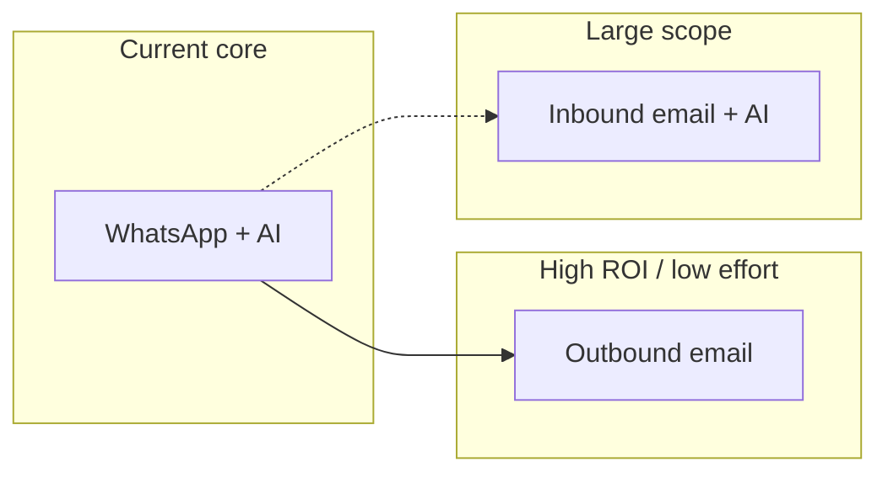

# Email for appointments: useful, easier, cheaper?

## How your app works today

- **Customer channel**: WhatsApp (Meta or Twilio) in [`src/lib/ai-agent.ts`](src/lib/ai-agent.ts) and webhooks in [`src/app/api/webhooks/whatsapp/route.ts`](src/app/api/webhooks/whatsapp/route.ts).
- **Data model**: [`Appointment`](prisma/schema.prisma) has `customerPhone` only; no `customerEmail`.
- **After booking**: Google Calendar event ([`src/lib/google-calendar.ts`](src/lib/google-calendar.ts)); the AI can send WhatsApp replies when configured.

So "handle emails" can mean two very different things.

---

## Two interpretations

### A) Outbound email only (confirmations, reminders, receipts)

| Dimension | Verdict |
|-----------|---------|
| **Useful** | **Yes** — many users expect a written confirmation, reminders reduce no-shows, and you get an audit trail outside chat. |
| **Easier** | **Yes, relative to building more WA features** — typical stack: Resend/Postmark/Send + templates + a cron or event hook after `book_appointment`. No new NLP channel. |
| **Cheaper (money)** | **Yes** — transactional email is very cheap; WhatsApp is priced per 24h conversation (Meta) or per message (Twilio), so **notifications** are often cheaper on email. |

Caveat: you must collect a **customer email** (new field, privacy/consent) or only email the business owner.

### B) Inbound + conversational "book by email" (like WA)

| Dimension | Verdict |
|-----------|---------|
| **Useful** | **Maybe** — reaches people without WhatsApp; often worse UX than a modern chat (threads, delay, spam). |
| **Easier** | **No** — you need IMAP/Graph/parsing, thread correlation, idempotency, and another agent path parallel to the WA pipeline. **Harder** than your existing single webhook + phone identity model. |
| **Cheaper** | **Mixed** — infra can be low cost, but **engineering + support** is usually higher; it does not replace WA costs unless you **sunset** WA for some segment. |

---

## Recommendation

- For **"useful + easier + cheap"**, prioritize **outbound** transactional email (and optionally **owner** notifications) tied to `book_appointment` / status changes, not a second full booking channel.
- Treat **"customers email the bot to book"** as a **separate product** with clear audience (B2B, desk workers) and budget — it is not a shortcut.

---

## If you move forward (brief)

- **Schema**: add optional `customerEmail` on `Appointment` (or collect at booking in WA).
- **Provider**: e.g. Resend (common with Next.js) + verified domain, SPF/DKIM.
- **Triggers**: after successful book, reschedules, cancellations, optional 24h reminder (cron or queue).
- **Scope control**: do **not** conflate with "email chat" until outbound is done and you have demand.

No code or repo changes are required for this answer; it is a product and architecture tradeoff.
