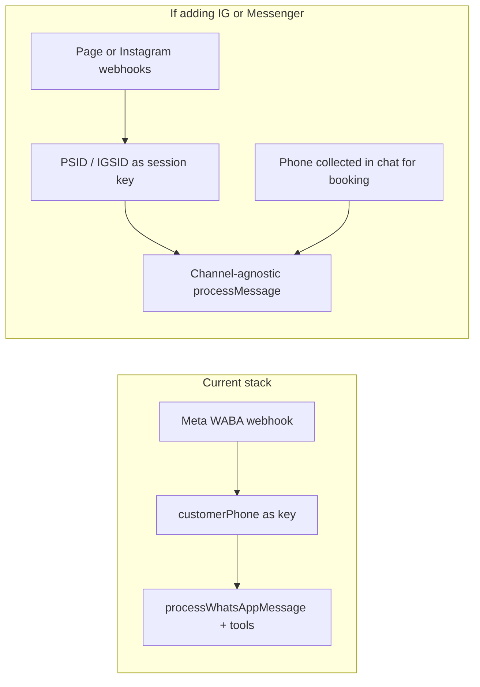

# Instagram / Messenger vs WhatsApp for appointments (tradeoff)

## Is it useful?

**Often yes, for the right business model.** Many customers (especially in beauty, food, local retail) already use Instagram DMs. Messenger can matter if your page traffic is on Facebook. It does **not** replace WhatsApp globally—WhatsApp is still dominant in many regions—so the product decision is **audience fit**, not “better in the abstract.”

## Is it easier (for *this* codebase)?

**No.** The project is structurally **WhatsApp-centric** today, so “add another channel” is a **refactor + new integration**, not a small toggle.

Evidence:

- The Meta webhook [src/app/api/webhooks/whatsapp/route.ts](src/app/api/webhooks/whatsapp/route.ts) only handles `object === "whatsapp_business_account"`. Instagram and Messenger webhooks use **different** `object` values and payload shapes (typically `instagram` and `page`), so you add **new handlers** (or a unified router) rather than reusing the current branch.
- [src/lib/whatsapp/meta-provider.ts](src/lib/whatsapp/meta-provider.ts) parses WABA-style fields (`phone_number_id`, etc.); Messenger/Instagram need **Page ID, sender `id` (PSID/IG-scoped), and different send endpoints** than WhatsApp’s Cloud API messages format.
- [src/lib/ai-agent.ts](src/lib/ai-agent.ts) `processWhatsAppMessage` and the [Conversation](prisma/schema.prisma) model key threads with **`userId` + `customerPhone`**, and tools/booking assume that string is a **phone** (e.g. for calendar copy / booking). DMs do not give a reliable E.164 phone; you would either (a) **ask the customer for a phone in-chat** and treat “channel id” as session identity, or (b) **widen the data model** to `channel` + `externalId` and relax “phone is the only key.”

So: **reusing the LLM and tool ideas is easy; reusing the integration layer is not.**

## Is it cheaper (Meta / ops)?

- **Do not equate** “Messenger/Instagram” with “free for all use cases.” Meta’s **commercial rules and product pricing differ by API surface** and change over time. A fair statement: **WhatsApp Business Platform often has explicit per-conversation commercial pricing**; **Messenger/Instagram messaging has historically had a different (sometimes more favorable for standard customer-service use) model**, but you must **verify current pricing and message-type rules** in Meta’s business docs for your app category.
- **Your** costs (LLM tokens, your infra) are about the same per message unless you add heavy media or long threads.

**Bottom line on cost:** potentially **lower message fees** than WhatsApp in some cases, but **higher product/engineering** cost to support another channel and App Review for the right permissions.

## If you *did* add it, scope at a high level (for later implementation)

1. **Meta app**: add **Messenger** and/or **Instagram** products, webhook subscriptions, App Review for messaging permissions, link **Facebook Page** (required for Messenger; Instagram business + linked page for DMs).
2. **New webhook path(s)** or a single **Meta multiplexer** that routes by `object` and resolves **which tenant** (Page ID / IG business account) maps to a `User` in your DB.
3. **Data model / agent**: generalize from `customerPhone` to something like `channel` + `externalCustomerId` (and still collect **phone** in conversation for [Appointment](prisma/schema.prisma) if you keep phone-based business logic).
4. **Outbound**: implement send for Messenger Send API (and/or Instagram messaging API) alongside existing [src/lib/whatsapp/meta-provider.ts](src/lib/whatsapp/meta-provider.ts) patterns.

## Recommendation

- **Pursue IG/Messenger** if your go-to-market or pilot users **live in those inboxes** and you are willing to take on Meta app review and a **moderate** backend/UI scope.
- **Do not** expect it to be **easier** than shipping another WhatsApp feature in *this* repo; it is **a second channel** with different identity and APIs.
- **Cost**: evaluate **per-channel Meta pricing** for your use case, not a universal “cheaper” rule.

No code changes in this pass; this is an architecture and product tradeoff read against the current [README.md](README.md) positioning and the WhatsApp-only webhook/agent wiring above.
