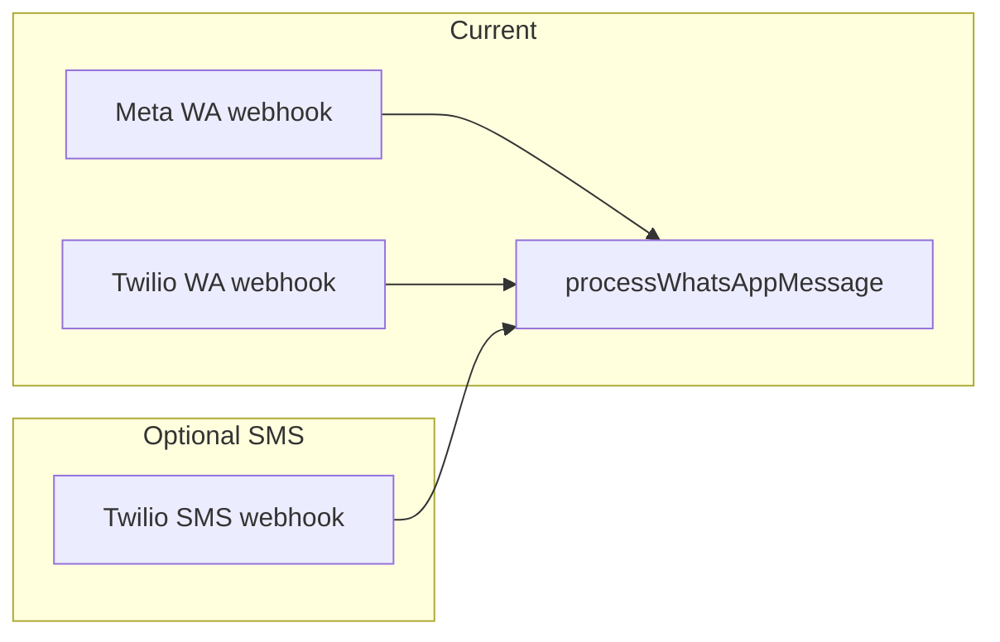

# SMS for appointments: useful, easier, or cheaper?

## What you have today

- **Inbound + outbound** booking conversations go through [`processWhatsAppMessage`](src/lib/ai-agent.ts), which uses the same LangChain + tools path regardless of how the message arrived.
- **Meta** and **Twilio** are both supported. Twilio sends using `whatsapp:...` on both `from` and `to` in [`TwilioWhatsAppProvider`](src/lib/whatsapp/twilio-provider.ts). The webhook in [`src/app/api/webhooks/whatsapp/route.ts`](src/app/api/webhooks/whatsapp/route.ts) already parses Twilio `application/x-www-form-urlencoded` payloads and looks up a row in `WhatsAppConfig` by the business number.
- For **Twilio-WhatsApp**, the lookup matches `twilioPhoneNumber` to the **inbound** `To` (after stripping the `whatsapp:` prefix). A plain **SMS** from Twilio would use a different `To` / number model than a WhatsApp sender in many accounts (separate long/short code vs approved WhatsApp sender), so you cannot assume one config row covers both without explicit product and Twilio number design.

## Is it **useful**?

| Angle | Takeaway |
|-----|----|
| **Reach** | In the US, SMS is universal; in many countries WhatsApp dominates for messaging. For **one-way** messages (reminders, confirmations, “you’re booked”), SMS is often expected and has very high open rates. |
| **Conversational booking** | Your agent is built for back-and-forth. **SMS** is short (GSM-7 length limits, multipart costs), no rich context, and worse UX for long flows than WhatsApp. It can still work for a **narrow** intent (“book”, “list slots”, “yes/no”) with tight prompts. |
| **Positioning** | A second channel increases operational surface (support, opt-out, “wrong number”, spam perception). It is “useful” mainly if your customers or their end-users **do not** want to use WhatsApp, or you need **non-marketing** transactional SMS for compliance/expectations. |

**Bottom line:** Most valuable as **reminders/confirmations** and optional **lightweight** replies, not as a full parallel to the WhatsApp experience unless the market demands it.

## Is it **easier**?

- **If you already use Twilio for WhatsApp:** Technically **moderate, not trivial**. The Twilio `messages.create` API is the same; you drop the `whatsapp:` prefix for SMS. The webhook `Body` / `From` / `To` shape is the same as today’s Twilio path; [`parseTwilioWebhookPayload`](src/lib/whatsapp/twilio-provider.ts) would need to distinguish SMS vs WhatsApp (e.g. `From` starting with `whatsapp:` vs E.164) and map `To` to the right stored business number, because SMS and WhatsApp senders are often different numbers in Twilio.
- **If you only use Meta Cloud API:** SMS is **not** available from Meta; you would add **Twilio (or another SMS provider)** and new env/config, so **not easier** than staying WhatsApp-only.
- **Product complexity:** You must model **per-channel** behavior (opt-in, STOP/HELP, rate limits) if you do marketing or mixed messaging; that is extra work beyond the webhook.

## Is it **cheaper**?

- **No universal answer** — it depends on country, message type, and volume.
- **WhatsApp (Cloud API):** Charged as **conversations** (and templates where applicable). Free tiers / lower rates can apply in some periods or regions; high-volume patterns differ from SMS.
- **Twilio SMS (US, typical):** Per-segment pricing (roughly a few **tenths of a cent to ~1c+** per segment depending on number type and direction); long bodies bill multiple segments.
- **Rule of thumb:** For **very short, infrequent** transactional texts (e.g. one reminder per appointment), SMS can be **competitive** with WhatsApp **session** pricing, but for **sustained two-way** chat, WhatsApp is often more predictable for international users, while SMS can get expensive at scale in the US.

You should use **current Twilio and Meta price pages** and your expected **messages per appointment** to compare; the codebase does not change that economics.

## Recommendation

1. **Do not add SMS** “because it is cheaper or easier” in general — for this project, **WhatsApp is already the primary integration** and the AI path is **named and scoped** to it; SMS is an **additional** vendor surface and compliance topic.
2. **Do consider SMS** if you have a clear segment that **cannot** use WhatsApp, or you want **transactional** SMS (reminders, OTP-style codes, strict confirmations) as called out in your own roadmap ideas in [`.cursor/plans/bookme_ai_next_steps_a61d91b5.plan.md`](.cursor/plans/bookme_ai_next_steps_a61d91b5.plan.md) — that is where ROI is usually highest.
3. If you add it, the **lowest-complexity** path is: **Twilio users only**, reuse `processWhatsAppMessage` with a clear inbound branch and possibly a **dedicated** Twilio SMS number field on [`WhatsAppConfig`](prisma/schema.prisma) (or a small schema extension), plus explicit **TCPA / consent** handling for the jurisdictions you target.

No code changes are required until you choose to implement; the next concrete step is deciding **SMS for reminders only** vs **full AI SMS parity**, and **Twilio-only** vs “any SMS provider”.
