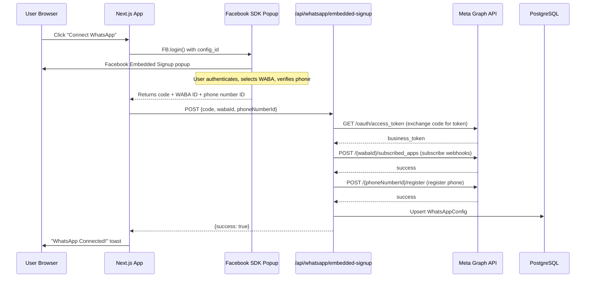

# WhatsApp Embedded Signup Integration

## Meta App Setup (Manual -- Before Code Changes)

You need to configure 3 things in your Meta App Dashboard:

**1. Ensure WhatsApp product is added to your app**

- Go to [Meta App Dashboard](https://developers.facebook.com/apps/) > Your App > Add Product > WhatsApp

**2. Get your App ID and App Secret**

- **App ID**: Displayed at the top of the App Dashboard
- **App Secret**: App Dashboard > App Settings > Basic > App Secret (click "Show")

**3. Create an Embedded Signup Configuration**

- Go to App Dashboard > WhatsApp > **Embedded Signup Builder** (also called "ES Integration")
- Click "Create Configuration" (or "Get Started")
- Select permissions: `whatsapp_business_management` and `whatsapp_business_messaging`
- Choose "Cloud API" for the flow type
- Save and copy the **Configuration ID** (a numeric string)

**4. Ensure app is in Live mode** (for production) or add test users in Development mode

These 3 values become your new env vars:

```
FACEBOOK_APP_ID=your-app-id
FACEBOOK_APP_SECRET=your-app-secret
WHATSAPP_ES_CONFIG_ID=your-configuration-id
```

---

## Architecture




---

## Code Changes

### 1. New env vars in `[.env.example](.env.example)`

Add `FACEBOOK_APP_ID`, `FACEBOOK_APP_SECRET`, and `WHATSAPP_ES_CONFIG_ID` alongside existing vars.

### 2. New component: `src/components/whatsapp-embedded-signup.tsx`

A reusable "Connect WhatsApp" button component used by both onboarding and settings:

- Loads the Facebook JS SDK (`connect.facebook.net/en_US/sdk.js`) on mount
- Initializes `FB.init()` with the app ID (fetched from a new public env var `NEXT_PUBLIC_FACEBOOK_APP_ID`)
- Listens for the `message` event on `window` to capture WABA ID and phone number ID (sessionInfoVersion 2)
- On click, calls `FB.login()` with `config_id`, `response_type: "code"`, and `sessionInfoVersion: 2`
- On success, POSTs `{code, wabaId, phoneNumberId}` to `/api/whatsapp/embedded-signup`
- Shows loading/success/error states
- Accepts an `onSuccess` callback prop

### 3. New API route: `src/app/api/whatsapp/embedded-signup/route.ts`

Server-side POST handler that performs 4 steps:

1. **Exchange code for token**: `GET https://graph.facebook.com/v21.0/oauth/access_token?client_id=APP_ID&client_secret=APP_SECRET&code=CODE`
2. **Subscribe to webhooks**: `POST https://graph.facebook.com/v21.0/{wabaId}/subscribed_apps` with the business token
3. **Register phone number**: `POST https://graph.facebook.com/v21.0/{phoneNumberId}/register` with `messaging_product: "whatsapp"` and a generated PIN
4. **Save to DB**: Upsert `WhatsAppConfig` with provider `META`, the WABA ID, phone number ID, and the business token

### 4. Update onboarding: `[src/app/onboarding/page.tsx](src/app/onboarding/page.tsx)`

Add a third step to the existing 2-step wizard:

- Current: `"profession" -> "business" -> complete`
- New: `"profession" -> "business" -> "whatsapp" -> complete`
- Step 3 shows the `WhatsAppEmbeddedSignup` component with a prominent "Connect WhatsApp" button
- Also shows a "Skip for now" link that proceeds to complete without connecting
- On success, proceed to complete the onboarding

The `handleComplete()` function stays the same (called after step 3 or after skip).

### 5. Update settings: `[src/app/(dashboard)/settings/page.tsx](src/app/(dashboard)`/settings/page.tsx)

In the WhatsApp tab:

- Add the `WhatsAppEmbeddedSignup` button at the top of the Meta section as the **primary** connection method
- Keep the existing manual form below it under an expandable "Advanced: Manual Configuration" section (collapsed by default)
- Twilio section remains completely unchanged
- On successful embedded signup, refresh the connection status

### 6. Add `NEXT_PUBLIC_FACEBOOK_APP_ID` and `NEXT_PUBLIC_WHATSAPP_ES_CONFIG_ID`

Since the Facebook SDK needs the App ID and Config ID on the client side, these must be `NEXT_PUBLIC_` prefixed. The App Secret stays server-only.

---

## Files Changed Summary

- **New**: `src/components/whatsapp-embedded-signup.tsx` -- reusable embedded signup component
- **New**: `src/app/api/whatsapp/embedded-signup/route.ts` -- server-side token exchange + registration
- **Modified**: `src/app/onboarding/page.tsx` -- add step 3 (WhatsApp)
- **Modified**: `src/app/(dashboard)/settings/page.tsx` -- add embedded signup button to WhatsApp tab
- **Modified**: `.env.example` -- add new env vars

No Prisma schema changes needed -- the existing `WhatsAppConfig` model already has all required fields (`wabaId`, `phoneNumberId`, `metaAccessToken`).