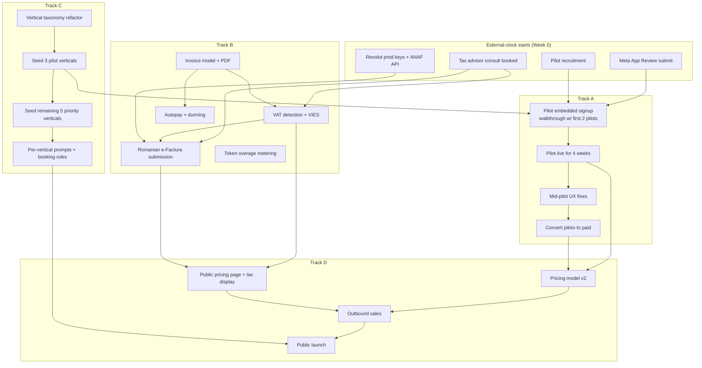

# 01 — Parallel tracks: how the work interlocks

> **Gate:** the four tracks described here do **not** begin until [`00-phase-0-app-readiness.md`](./00-phase-0-app-readiness.md) is signed off. Until Phase 0 sign-off we have not proven the product works end-to-end and we are not ready to put a pilot or a paying tenant on it.
>
> The only exceptions are external-clock starters (Meta App Review, tax-advisor consult booking, pilot warm-intro conversations) which begin **during Phase 0** because their queues are the slowest thing in the roadmap.

This document answers one question: **given limited engineering time, in what order do we start things so we are blocked the least amount of time?**

The answer is "start anything with external dependencies first, even if rough, because *their* clock starts the moment we contact them, not the moment we are ready."

---

## 1. The four tracks, again — but with their **blocker types**

| Track | What it produces | Blocker type | Why it must start early or late |
|---|---|---|---|
| **A — Signup + pilots** | Pilots using the product, embedded signup proven in the wild | **External calendar** (pilots' availability, Meta App Review queue) | Must start **Week 0**. Their clock is not our clock. |
| **B — Billing + taxes** | Tax-correct invoicing, dunning, e-Factura | **Internal dev hours**, but with one external input (tax advisor consult) | Tax advisor consult booked Week 0, code work runs Weeks 1–10. |
| **C — Vertical defaults** | Defaults for 8 verticals + per-vertical prompts | **Internal dev hours**, low coordination cost | Small, continuous, fills gaps between A/B sprints. |
| **D — GTM + launch** | Pricing, sales motion, launch | **Gated on outputs of A + B** | Cannot meaningfully start until pilot data lands (Week 6+). |

---

## 2. The "never wait" rule, applied

For every piece of work, we ask: **what is the longest external-clock dependency, and is it started?** If not, we start it before anything else, even with imperfect inputs.

### 2.1 External-clock dependencies that get kicked off on Day 1

| Dependency | Why slow | Started by | Owner |
|---|---|---|---|
| Recruiting 5 pilots | Each pilot is a human conversation. Conversion 50% means we need 10 conversations. | Founder outreach in week 0 | Founder |
| Meta App Review for `whatsapp_business_management` | 1–3 weeks queue. We do not control speed. | Submission in week 0, with whatever screencast we have | Eng |
| Tax advisor consult (RO + EU VAT for USD-charged SaaS) | Their calendar, not ours. Usually 1–2 weeks to book. | Email/booking in week 0 | Founder |
| Revolut Business **production** API keys + e-Factura ANAF API access | KYC + API enablement at the provider's pace. | Application in week 1 | Founder + Eng |
| First customer reference quote (for the website) | Pilot needs to be live ≥3 weeks before they will say something quotable. | Implicit — week 0 → quote available ~week 6 | Founder |

If any of these slip out of Week 0, the whole roadmap slips with them.

### 2.2 Heads-down dev work that fills the wait

The tax advisor takes 2 weeks to reply with their answer? Fine — Track C ships defaults for 3 pilot verticals in those 2 weeks. Meta App Review is in queue? Fine — Track B builds VATIN validation against VIES. Pilots are using the product and we are waiting for breakage reports? Fine — Track B ships PDF invoice generation.

This is the operating mode: **dev hours never sit idle waiting for external dependencies; they go into whichever queued internal task has the next biggest payoff.**

---

## 3. Dependency graph (what blocks what)

Read it as: anything pointing into a node must finish before that node can start. The **critical path** to public launch (D4) runs:

`E1 → A1 → A2 → A3 → A4 → D1 → D3 → D4` (the pilot path) and `E3 → B2 → B3 → D2 → D3 → D4` (the tax path).

If either path slips, D4 slips. Both paths start with an *external* node, which is why both external nodes must launch in Week 0.

---

## 4. Sequencing rules of thumb

These are the operating rules we will follow when prioritising day-to-day:

1. **Start every external-clock task on Day 1**, even with rough inputs. We can polish while it sits in their inbox.
2. **Never let dev sit idle.** If Track A is blocked on a pilot's calendar, dev is on Track B or C, never "waiting for the pilot."
3. **Pilots get product changes within 48h** of breakage reports. They are giving us free time. Honour that.
4. **Tax compliance must precede public launch.** We can run pilots without invoices for ≤8 weeks; we cannot run public commerce that way.
5. **Vertical defaults are not allowed to expand beyond the 8 priority verticals until ≥3 priority verticals have a paying tenant.** Avoid building defaults for verticals we cannot prove demand for.
6. **One LLM at a time.** We have Gemini + OpenAI; do not add a third until overage metering proves we are cost-bound.
7. **No new conversational channels in the 12 weeks.** Outbound transactional email is the only channel addition allowed, and only if pilot reminder/no-show data justifies it.

---

## 5. What we will deliberately do badly

To stay on this timeline, the following are *good enough* and we will not over-engineer them:

- **Invoice PDF design.** A clean Tailwind-styled HTML → PDF is sufficient. No custom layout per tenant in v1.
- **Localisation.** EN + RO only in the dashboard. We are not translating into German/French/etc. until a tenant in that country signs up.
- **Customer (end-user) WhatsApp experience.** It already works; we will not add features. We are validating onboarding for tenants, not redesigning the chat.
- **Admin tooling.** No internal admin console. We use SQL + Prisma Studio against the production DB for ops, with audit logging. Build the admin console after launch.
- **Analytics.** Pilot data is collected in a spreadsheet + raw DB queries. No analytics pipeline before launch.

---

## 6. What this roadmap is **not** saying

- Not saying "the product is ready; this is a sales playbook." The product needs work — billing, defaults, signup polish. This roadmap is the work plan.
- Not saying "billing is the most important thing." Pilots are. Billing is the *most-likely-to-be-deferred-and-then-cause-a-3-month-delay* thing, so it is started in parallel with pilots, not after.
- Not saying "we are stopping all other work." Bug fixes, security patches, dependency upgrades continue as normal alongside the four tracks.
