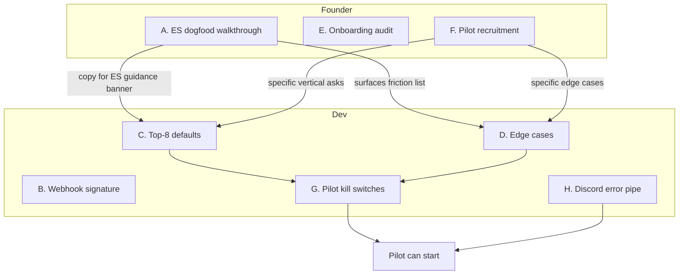

# 01 — Pre-pilot (≈2 weeks)

> **Goal:** by end of week 2, a non-technical owner can self-onboard in <15 minutes without a screen-share, and 3–6 pilots are signed up.
>
> **Definition of Done:** see [bottom of doc](#definition-of-done). Everything in this stage exists because **no friendly customer can test it for us**.

---

## Why this stage exists

Right now we are blocking ourselves on three things that no pilot customer can validate:

1. **Embedded Signup actually works for someone who has never seen Meta Business Manager.** We are Tech Provider. Manual paste path exists as a fallback; we don't yet know if ES exits cleanly when the WABA has no payment method, what the error message reads like, or how long it takes a real human.
2. **Default services for the verticals we'll actually pilot in.** The spreadsheet's Priority 1 list does not include `DENTIST` (#14) and only partially overlaps `MECHANIC` (auto repair, #5). Without proper defaults for at least barber, nails, dog grooming, auto repair, MedSpa, physiotherapy we are asking the owner to type their entire service menu — that's the step where pilots ghost us.
3. **The four customer-facing edge cases that hit week-one.** Reschedule, calendar race, business-hours edge cases (lunch break, day off), language detection. Anything else waits.

If we do these three things, the pilot can start. Everything else — multilingual answers, reminders, Customer entity, analytics, tests — is held until **after** GTM.

---

## Work list, prioritised by "blocks the most parallel work"

### Week 1 — unblock the pilot ramp

#### A. Embedded Signup dogfood (founder, 2–3 days)

1. Create a brand-new throwaway business (your own LLC / a real friend's) with **zero existing Meta assets**. Don't reuse the dev WABA.
2. Run the entire Embedded Signup flow as a normal user — record the screen.
3. Time **each step**, capture each error. Specifically watch for:
   - The point at which the user is asked to add a payment method in WhatsApp Manager. **What does our app show in the meantime?** (Today: probably "WhatsApp connected" with no further guidance.)
   - The display-name approval step (sometimes auto, sometimes manual).
   - The phone-number verification SMS / call.
   - The token storage on our side — confirm we persist exchange tokens correctly (`/api/whatsapp/embedded-signup`).
4. **Outputs of this exercise (deliverables):**
   - Update `whatsapp-error-131031-troubleshooting.md` style doc with **"first-time Embedded Signup walkthrough"** — what a pilot sees, what to do at each step, screenshots.
   - Add an in-app banner in `/settings` that walks the tenant through the WhatsApp Manager payment-method add **with a deep link** (`https://business.facebook.com/billing_hub/payment_settings`), shown until `metaPaymentMethodConfirmed` is true on `WhatsAppConfig`.
   - File one bug per friction point — fix the ones that take <30 min, defer the rest with a one-line justification in [`risks-and-decisions.md`](./risks-and-decisions.md).

#### B. Wire Meta webhook signature verification (1 hour)

[`docs/app-overview.md §7.8`](../app-overview.md) says `verifyWebhookSignature` exists but isn't wired. Wire it. This is the only "security must" we do pre-pilot — every other webhook in production is signed, ours shouldn't be the exception. One small commit.

#### C. Top-8 vertical defaults (1–2 days, parallel to A)

See [`defaults-by-vertical.md`](./defaults-by-vertical.md) for the full default tables. Implementation:

1. Extend `Profession` enum in `prisma/schema.prisma`:
   ```
   BARBER, NAILS, LASH_PMU, DOG_GROOMING, AUTO_REPAIR,
   TIRE_ITP, MEDSPA, PHYSIO,
   DENTIST, MECHANIC // keep for back-compat with seed data
   ```
   Run `npx prisma db push --accept-data-loss` against staging.
2. Extend `src/lib/defaults.ts` with the eight service lists from `defaults-by-vertical.md`.
3. Update the onboarding profession picker (`src/app/onboarding/page.tsx`) to show **the eight Priority 1 verticals first**, with `DENTIST` / `MECHANIC` grouped under "Other" — they're the demo, not the GTM.
4. Each new vertical gets:
   - 4–6 default services with price + duration that look defensible for an EU mid-market town (we localise per market later).
   - A vertical-aware **agent system-prompt addendum** (single sentence) injected from `defaults.ts` — e.g. "You schedule appointments for a **barbershop**; default service is a haircut. Ask the customer if they want a beard trim add-on."
5. Don't bother with currency switching yet — the price field is a number, the owner edits it in the dashboard. Currency in the AI's replies is taken from `BusinessProfile.currency` (add the field; default `RON` for RO Google sign-ins, `USD` for everyone else, based on Google locale).

#### D. Critical edge cases (3–4 days, parallel)

These are the four week-one customer-encountered failures. **Every other edge case is deferred.**

| Edge case | Why it happens in week one | Cheapest fix |
|---|---|---|
| **Reschedule** | Customers ask to move a booked slot all the time; today the agent admits it can but has no tool. | Add `reschedule_appointment(appointment_id, new_start_time)` to the LangChain tool list. Implementation = `cancel_appointment` + `book_appointment` wrapped in one DB transaction, but **without a re-confirmation prompt** to the customer (cheaper UX, dev speed > polish). |
| **Double-sync / manual calendar event race** | Owner adds a slot to Google Calendar by hand at 14:00 between `get_availability` and `book_appointment` — AI books a conflict. Common in salons. | On `book_appointment` tool, re-fetch availability for the requested slot **inside the same handler** and reject if conflict; AI re-suggests. No locking, no transactions, just a re-check. |
| **Lunch break / day off mid-week** | Default business hours are start–end per day; can't model 09:00–13:00 + 15:00–19:00 or "closed on Tuesday". | Extend `BusinessProfile` hours to a JSON array of `{day, start, end}` segments. Update `get_availability` + agent prompt. Use the dashboard UI ([already 7 days × start/end](../../src/app/(dashboard)/settings/page.tsx)) by adding a second segment row. |
| **Language detection** | RO pilots will hit RO-speaking customers; US pilots English. Today the prompt is English-only. | One line in the system prompt: `"Reply in the language the customer's last message is written in."` That's it. Real localisation waits until post-GTM. |

If any of these takes more than its allotted day, **descope**, don't refactor. The chat simulator validates each in <2 min.

#### E. Onboarding-step audit (last day of week 1, founder)

Sit with a non-technical friend and **time every onboarding step**. Anything that takes >30 seconds and isn't strictly necessary, cut it. Specifically:

- Combine "Profession" + "Business profile" into one screen. (Today they're two.)
- Move WhatsApp connect to **after** the user has seen the dashboard with seeded services — gives a moment of "oh, this is what it'll look like."
- Pre-fill timezone from browser, do not ask.
- Default business hours: Mon–Fri 09:00–18:00, Sat–Sun closed. Editable, not required.
- Skip the WhatsApp connect step entirely with a big "Try the chat simulator first" button — pilots can experience the product without ES at all.

---

### Week 2 — pilot recruitment + small polish

#### F. Pilot recruitment outreach (founder, ongoing through week 2)

Target: **6 verbal commits, expect 3 to actually log in.** All Priority 1 verticals. Personal-network first, then warm intros, then niche FB groups (the marketing strategy doc covers this). Recruitment script in [`02-pilot.md`](./02-pilot.md).

#### G. Pilot-only "kill switch" flags (half day)

We will give pilots a free product. We need to be able to:

- Mark a tenant as `User.isPilot = true` (boolean on `User` model).
- Skip subscription enforcement for pilots (`SubscriptionGate` returns early).
- Tag conversations from pilot tenants in logs (`Conversation.pilotTenant`, derived).
- See pilots on a `/admin/pilots` page (one read-only page; we'll be living in it daily).

This is the **only** infra change we make for the pilot.

#### H. Founder-side observability (half day)

- Pipe all `processWhatsAppMessage` errors into a Discord/Slack webhook (`PILOT_ALERT_WEBHOOK_URL`). No Sentry yet — too much setup. One `try/catch` around the agent loop and a `fetch(webhook, …)`.
- Pipe Revolut webhook failures the same way.
- A nightly cron summary (existing Vercel Cron infra) of `(tenants active, messages handled, appointments booked, errors)` → same webhook.

That's enough observability for the pilot. **No Sentry, no PostHog, no Datadog, no logging stack.** Add those post-GTM.

---

## Critical edge cases (do these, skip everything else)

The four customer-facing edge cases in **D** above. **Explicitly deferred:**

| Deferred edge case | Defer until |
|---|---|
| Multilingual prompt + localised receipts | Post-GTM Stage 1 (after we see a real RO/EN customer mix). |
| Customer entity (first-class `Customer` model) | Post-GTM. `(userId, customerPhone)` is fine. |
| Reminders (24h / 1h) via WhatsApp template | Stage 4 paid launch (template approval takes ~1 week; start in parallel with paid launch). |
| Outbound email confirmations | Stage 4 paid launch (Resend already in deps, 1-day build). |
| Per-tenant rate limiting | Post-GTM. Pilots can't DDoS us. |
| `appointmentNotes` / "internal notes" on booking | Post-GTM unless a pilot specifically asks. |
| No-show flag / appointment status workflow | Post-GTM. |
| Tenant-side drag-to-reschedule UI | Post-GTM. |
| Group bookings (2 customers, same slot) | Post-GTM unless multiple pilots hit this. |
| Recurring bookings (weekly physio) | Post-GTM. Physio pilot can fake it with manual rebook. |

---

## Parallelism — who's doing what



If only one developer, sequence is `B → C → D → G → H`; A / E / F happen on calendar time independent of dev.

---

## Definition of Done

The stage is done when **all** of the following are true:

- [ ] One real business — not the dev WABA — has completed Embedded Signup end-to-end **without us touching it after the share link was sent**, and a customer-sent WhatsApp message has been booked into that business's Google Calendar.
- [ ] The eight Priority 1 verticals are in the `Profession` enum, in the onboarding picker, and have default service lists ([table B in defaults-by-vertical.md](./defaults-by-vertical.md#service-defaults)).
- [ ] The `reschedule_appointment` tool exists and the chat simulator demonstrates a reschedule end-to-end.
- [ ] The agent re-checks availability inside `book_appointment` and the chat simulator demonstrates the race rejection.
- [ ] `BusinessProfile.hours` supports lunch-break / day-off shapes; settings UI accepts a second segment per day.
- [ ] The agent system prompt contains the language-mirroring instruction and a manual chat simulator run confirms RO + EN replies.
- [ ] Meta webhook signature is verified on every POST.
- [ ] `User.isPilot` flag exists; `/admin/pilots` is reachable.
- [ ] All `processWhatsAppMessage` and Revolut webhook errors hit a single Discord/Slack webhook.
- [ ] Onboarding has been timed end-to-end at **≤15 min** by a non-technical participant on a fresh account.

Anything not on this list is **out of scope for pre-pilot.** Drop it.
