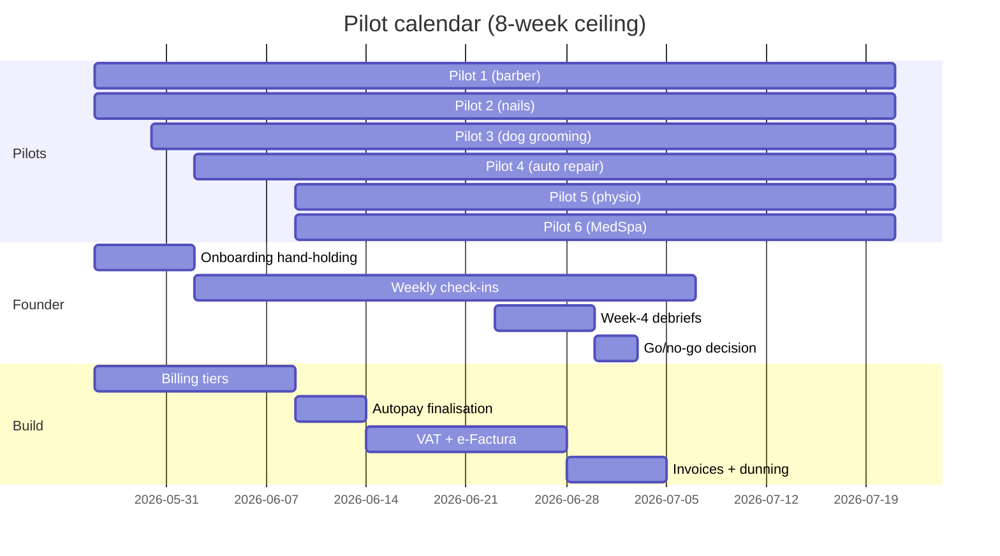

# 02 — Free pilot (4–8 weeks)

> **Goal:** prove that real service businesses, given the product for free, find it useful enough that they would pay for it. Collect the qualitative data that tells us what to build next. **No billing logic gates this stage.**

---

## What "pilot" means here

- **3–6 friendly businesses** drawn from the Priority 1 verticals in the spreadsheet (barber, nails, eyelash/PMU, dog grooming, auto repair, tire+ITP, MedSpa, physio). Mix of RO and US/EU if possible — but if the founder's network is RO-only, run all-RO and lean on the RO Meta CPM advantage from the marketing doc.
- **Free for the duration.** No credit card requested. `User.isPilot = true`, subscription gate bypassed.
- **4 weeks minimum, 8 weeks maximum.** Less than 4 we don't have a working week's data; more than 8 we are stalling on paid launch.
- **They use it as if we were a real vendor.** Real WhatsApp number, real customers, real Google Calendar. We don't seed fake bookings.
- **One channel of feedback.** A shared WhatsApp group with the pilots, or a single email thread per pilot. Not a Notion board they have to log into; not a feedback form. Friction kills response rate.

---

## Recruitment

### Sourcing

In order of efficacy for a sole-founder pilot:

1. **Personal network.** People who already trust you enough to tell you the product is bad. Worth their weight in gold.
2. **Warm intros from your network.** "I'm building an AI receptionist for [vertical] — do you know anyone running a [salon / shop]?"
3. **Vertical Facebook groups** (`Patroni de saloane`, `Mecanici auto Romania`, US equivalents). Don't pitch in the group — comment helpfully, DM warm leads.
4. **Local supplier intros.** A salon-supply rep talks to 30 salons a week and will introduce you for free.

Do **not** run paid ads to recruit pilots. We don't yet know what creative works; we'd be paying to learn nothing.

### The ask, in writing

A short message they can read in 15 seconds. Use this skeleton (RO version + EN version):

> "Hey [name]. I built an AI that handles WhatsApp bookings for [vertical]. It checks your Google Calendar, books the slot, replies to the customer — no app for them to install. **I'd give it to you free for two months** in exchange for honest feedback. Setup is ~15 min. Interested?"

### What "yes" buys you (their commitment)

- They give you 15 minutes once at the start (you watch them set up on a screen-share, you don't help unless they're stuck).
- They send you one WhatsApp voice-note per week for 4 weeks with anything that frustrated them.
- They put your AI number on at least one channel they actually use — Instagram bio, Google Business Profile, a sticker at reception.
- They agree to a 30-min debrief call in week 4.

### What they expect from you

- No bugs that lose a customer. If the AI books wrong, you fix it that day.
- A WhatsApp DM available 09:00–21:00 their time.
- A clear "this is what we'll do if you decide to keep using it" conversation in week 4.

---

## What we measure during the pilot

We are pre-pilot. We don't have product analytics. **That's fine.** Measure the smallest possible set, by hand, in a single Google Sheet.

| Metric | How it's collected | Why we care |
|---|---|---|
| **Setup completion** | We watch; they finish ES or we have to step in | Validates the pre-pilot DoD wasn't a lie. |
| **Day-1 message received** | Discord webhook tells us a real customer messaged | Did they actually share the number? |
| **Booking success rate** | Count appointments booked vs. conversations that mentioned a date/time | The core product metric. |
| **Pilot-reported drops** | Their voice-note + our `errors` Discord channel | Where the agent fails. |
| **Pilot WTP (willingness to pay)** | One question in the week-4 debrief: "If this stopped working tomorrow, would you pay €25/month to keep it? €50?" | Calibrates the tier price. |
| **Weekly active conversations** | Count distinct `(userId, customerPhone)` per week | Is it being used or sitting idle? |

**Do not build a dashboard for this.** A spreadsheet with seven columns is enough.

---

## What we deliberately do **not** do during the pilot

| Item | Why we don't |
|---|---|
| Charge them | The point of the pilot is to learn, not to monetise. Charging changes their feedback. |
| Build feature requests verbatim | Build the **third** request, not the first. The first is reactive, the third is signal. |
| Add a second messaging channel | We will not be a Messenger / Instagram / SMS app for one pilot. WhatsApp only. |
| Onboard pilots over screen-share by default | We are testing whether self-serve works. Screen-share only if they're stuck after 15 min. |
| Write tests | Still no. The chat simulator + Discord error pipe is sufficient. |
| Hire | A sole-founder pilot is fine. Hiring before we know what the product is is the most expensive mistake we can make. |

---

## In parallel: build billing + tax

While the pilot is running, the founder's time splits roughly:

- **30%** — pilot support (debugging incidents, weekly check-ins).
- **70%** — building [`03-billing-and-tax.md`](./03-billing-and-tax.md).

If pilots are quiet, billing absorbs more of the time. **Never let billing block a pilot incident.**

---

## Pilot week-by-week sketch

---

## Decision gate at end of pilot

Hold a one-hour founder-only meeting after the debriefs. Answer three questions in writing, **before** opening the spreadsheet of metrics (so the narrative doesn't pre-bias the data):

1. **Did the AI handle a real customer message → real Google Calendar booking, in production, more times than it failed?**
2. **Did at least 50% of pilots say "yes, I'd pay" at €25 or above?**
3. **Was there a single recurring failure mode we could fix in <2 weeks?**

| Answers | Decision |
|---|---|
| Yes, Yes, Yes/No | **Go.** Move to [`04-paid-launch.md`](./04-paid-launch.md). |
| Yes, No, Yes | **Iterate.** Spend 2 weeks on the recurring failure mode, re-run a 2-week pilot extension, then re-decide. |
| Yes, No, No | **Pivot the offer.** Maybe it's free + paid templates, maybe it's per-booking pricing, maybe it's white-label for a salon-supply distributor. Re-read [`docs/app-overview.md §3.3`](../app-overview.md). |
| No, *, * | **Stop and rewrite the agent.** The product doesn't work yet. Do not move to paid launch. |

---

## Definition of Done

- [ ] 3+ pilots have run the product end-to-end for ≥ 4 weeks with at least one real customer booking each.
- [ ] Week-4 debrief done with every active pilot, three WTP answers recorded per pilot (€25 / €50 / "more than €50").
- [ ] One-page pilot retro doc committed under `docs/roadmap/retros/pilot-2026-Q2.md` with: top three failure modes, top three feature requests, WTP distribution, recommended next step.
- [ ] Go/no-go decision recorded in [`risks-and-decisions.md`](./risks-and-decisions.md).
