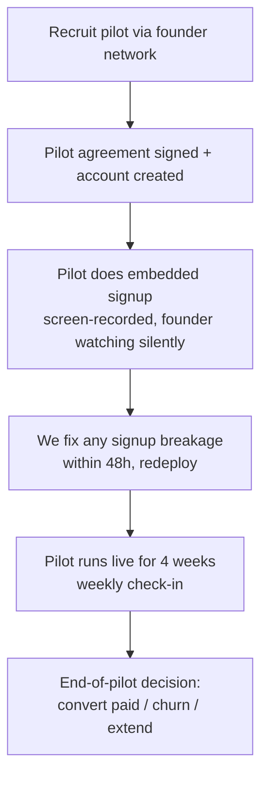

# Track A — WhatsApp signup validation + free pilots

**Status:** External-clock-blocked. Must start Week 0.

**Goal:** Prove that a non-technical tenant (a barber, a nail tech, a vet) can connect their WhatsApp Business number and start receiving AI-handled bookings **without us on a call**, and prove that the product is useful enough that the pilot wants to pay at the end.

---

## 1. Why this track exists

Today we are a tech provider. We have shipped a working AI receptionist. What we do **not** know is whether the actual signup flow — the part where a real business owner takes our embedded-signup link, walks through Meta's consent screens, gives us the right permissions, and ends up with a working webhook — is something they can do unaided.

Three things can be wrong, and only running real pilots tells us which:

1. **Meta App Review status.** If our app does not have `whatsapp_business_management` approved for the right surfaces, the embedded-signup completes for *us* (we are a tester on the app) but fails silently or with a useless error for real tenants. We have an internal troubleshooting note for error `131031` ([`whatsapp-error-131031-troubleshooting.md`](../../whatsapp-error-131031-troubleshooting.md)) which suggests we have already hit this once.
2. **UX clarity.** Meta's embedded-signup modal asks for confusing things (business display name, two-factor PIN for the WABA, message-template review). A real tenant will get stuck on one of these and our copy needs to walk them through it.
3. **Billing handoff.** The pilot has WhatsApp working but does not know how to choose a plan, when their trial ends, or how to enter a card. We have to watch this end-to-end.

We answer all three by sitting on a video call with the first 2 pilots while they sign up (yes, on a call — that is the *measurement* call, not a *handholding* call: we narrate nothing, we only watch), then unobserved for pilots 3–5.

---

## 2. ICP for the pilot (who we recruit)

From the 55-vertical list, the 8 "Priority 1" verticals are:

1. Barber shops / men's grooming (Frizerii)
2. Nail salons (Saloane manichiura)
3. Eyelash / PMU / microblading studios
4. Dog grooming (Toaletaj canin)
5. Independent auto repair (Service auto)
6. Tire shops + ITP stations (Vulcanizare + ITP)
7. MedSpas / aesthetic clinics
8. Physiotherapy (Kinetoterapie)

For the pilot we pick **3 of these 8** because we want signal across verticals without diluting our attention. Recommended pick (with rationale in [`07-risks-and-open-decisions.md`](./07-risks-and-open-decisions.md) §D1):

- **Barber shops** — high volume of short appointments, simple service list, WhatsApp-native customer base in RO.
- **Nail salons** — same dynamics as barbers but with female-skewed customer base and longer service mix; tests prompt generalisation.
- **Independent auto repair** — longer appointments, higher ticket price, customers who want to describe a problem in natural language; tests AI quality, not just calendaring.

Per vertical we want **1–2 pilots**, total **5 pilots**.

### 2.1 Pilot selection criteria

- Owner-operated or small (≤6 staff). We do not want enterprise feedback yet.
- Already uses WhatsApp Business or regular WhatsApp for customer messages.
- Has Google Calendar in active use (or willing to migrate). Outlook/iCal support is not in scope for the pilot.
- Located in RO (timezone, language, currency in their head are simpler for us to support).
- Willing to give us 30 minutes a week for 4 weeks.

### 2.2 What we offer the pilot

- **60 days free** (vs the default 30-day trial). Activated by setting `trialEndsAt` to 60 days on pilot accounts.
- A direct WhatsApp line to us for issues.
- Their logo on the website case-studies page (with consent) once they convert to paid.
- A 20% lifetime discount if they convert at end of pilot.

### 2.3 What we ask in return

- Be candid in weekly 15-min check-ins.
- Sign a one-page pilot agreement covering data handling + reference rights.
- Let us record (with consent) one onboarding session.

---

## 3. The five-step pilot sequence

### Step 0: Recruit
Founder reaches out to network for warm intros. Target 10 conversations to land 5 yeses. Time-box: **Week 0–1**.

### Step 1: Account + pilot agreement
Account created with `trialEndsAt = now + 60d`. Pilot agreement (one page) signed. Owner: founder. Time-box: **same week as recruitment**.

### Step 2: Observed embedded signup
30-minute Zoom. We share their screen, *not* ours. We narrate nothing. We log every place they pause >5s, every place they re-read a label, every error. We take written notes. **The pilot drives.** Time-box: **Week 1–2**.

This is the validation event. Three possible outcomes:

| Outcome | Action |
|---|---|
| Pilot completes signup unaided in ≤10 min | Mark as "passed". Move to step 3. |
| Pilot gets stuck on a UI label or copy | Log as a P2 copy bug. Pilot can continue manually with our help. Fix copy in next deploy. |
| Pilot gets a Meta error / silent failure / webhook does not receive | Mark as P0 blocker. Halt new pilots until fixed. |

We expect at least one P0 from the first pilot. That is the point of going first.

### Step 3: Fix breakage
48-hour SLA on signup breakage. The list is owned by the eng on Track A. Anything not fixed in 48h escalates to "Why?" and we re-plan.

### Step 4: Live for 4 weeks
- Weekly 15-min check-in (Zoom or WhatsApp).
- Mid-pilot survey at week 2 (5 questions; see [`06-pilot-playbook.md`](./06-pilot-playbook.md) §3).
- We monitor `Conversation` and `Appointment` rows daily for the first week, weekly thereafter. We do not contact the pilot unless something is broken.
- AI quality issues (wrong service booked, hallucinated time, etc.) go into a separate log because they are Track C inputs, not Track A.

### Step 5: End-of-pilot decision
30 days into the live phase (~Week 7), 15-min call:
- Are you getting value? (1–10)
- Would you pay $25/month?
- If we offered $20/month for life, would you commit today?
- Any reason you might churn even at $20/month?

Conversion target: **≥3 of 5**. Below that, we slow Track D and re-think pricing in [`05-track-d-gtm-launch.md`](./05-track-d-gtm-launch.md).

---

## 4. Engineering work inside Track A

Most of Track A is sales + support. The engineering work is small but blocking.

### 4.1 Meta App Review submission (Week 0)

**Action:** Submit the app for `whatsapp_business_management` permission with a screencast that shows:
- A tenant going through embedded signup.
- Their WhatsApp number receiving a test message via our app.
- The conversation appearing in the dashboard.

The screencast does not need to be polished. Submit it Day 1. Re-record only if Meta rejects.

**File pointers:** `src/app/api/whatsapp/embedded-signup/route.ts`. Verify the requested scopes match the App Review submission.

### 4.2 Pilot-only feature flags (Week 1)

Add a `User.isPilot: Boolean` flag (or `pilotCohort` enum if we want cohorts). Use it to:
- Default `trialEndsAt` to 60 days instead of 30.
- Suppress the subscription-expiry banner (`src/components/dashboard/subscription-banner.tsx`).
- Tag their tokens in metering so they do not count against any pilot cost analysis.

### 4.3 Onboarding telemetry (Week 1)

We need *quantitative* signup data, not just qualitative pilot calls. Instrument the onboarding pages with timestamped step-enter / step-exit events into a `OnboardingEvent` table. Minimum fields: `userId`, `step`, `enteredAt`, `exitedAt`, `errorMessage?`.

This is small (one new table + 4–5 instrumentation calls in `src/app/onboarding/page.tsx` and `src/app/api/whatsapp/embedded-signup/`). It pays for itself on the second pilot because we stop having to ask "where did you get stuck?"

### 4.4 Error-message audit (Week 2, after pilot 1)

After watching pilot 1, audit every user-visible error message in:
- `src/app/api/whatsapp/embedded-signup/`
- `src/app/api/whatsapp/connect/`
- `src/app/onboarding/`

Replace any developer-shaped error (`"131031: registration_required"`) with a human sentence + a "what to do" next step. The existing [`whatsapp-error-131031-troubleshooting.md`](../../whatsapp-error-131031-troubleshooting.md) becomes the source of the user-facing copy.

### 4.5 Chat simulator as a confidence test (Week 2)

Before sending the embedded-signup link, push the pilot to use the chat simulator at `src/app/(dashboard)/chat-simulator/page.tsx` with their *real* service list. If they like the AI's responses in the simulator, the embedded-signup step has more emotional buy-in. If they hate the simulator, we have caught the issue without burning Meta verification on a tenant who will churn.

---

## 5. Pilot data we collect

Per pilot, in a shared spreadsheet (yes, a spreadsheet — Track A does not need a dashboard):

| Field | Source |
|---|---|
| Vertical | Owner-stated |
| Signup completion time (min:s) | `OnboardingEvent` table (§4.3) |
| Signup interventions by us | Tally on the observed call |
| Number of bookings in week 1, 2, 3, 4 | `Appointment` count |
| Number of AI errors flagged by pilot | Slack/WhatsApp to founder, logged manually |
| Convert / churn / extend decision | End-of-pilot call |
| Quotable reference sentence | End-of-pilot call (with consent) |

This becomes the input to Track D pricing and Track B priorities (e.g. if 3 pilots ask for invoices, that is the signal that VAT-correct invoicing must ship before public launch — which it must anyway, but it's nice to have the receipts).

---

## 6. Exit criteria for Track A

We can declare Track A "done" and move into general launch when **all** of these are true:

1. ≥4 of 5 pilots completed embedded signup unaided (defining "unaided" as no us-on-call hand-holding; copy clarifications are allowed).
2. ≥3 of 5 pilots converted to paid (or committed to convert pending Track B billing readiness).
3. Zero P0 signup bugs open.
4. Meta App Review approved.
5. At least one pilot per vertical we plan to launch with.

If 1–4 are true but 5 is not, we have a *quality* product without *breadth* validation — we can launch in the verticals we proved but defer the others. See [`07-risks-and-open-decisions.md`](./07-risks-and-open-decisions.md) §D2.
