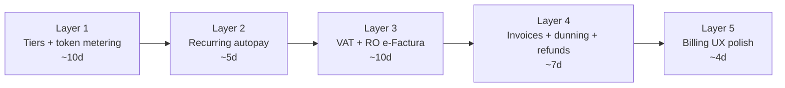
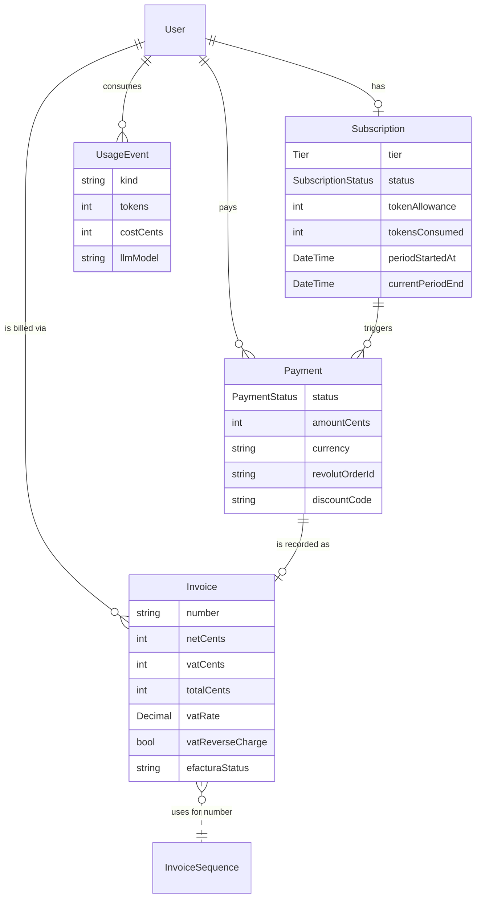

# 03 — Billing + tax (runs in parallel with pilot)

> **Goal:** by the time the pilot debrief is over, a paying customer can sign up, pick a tier, be charged automatically every month, get a tax-compliant invoice, and — if they're a Romanian B2B — see that invoice in e-Factura without us touching anything.
>
> **Why now and not pre-pilot:** see [`README.md`](./README.md). Pilots don't pay. Billing is the work that needs no customer to make progress. **It is the parallel track.**

This doc is the **plan + sequencing**. The detailed architectural choices live in [`billing-architecture.md`](./billing-architecture.md).

---

## Sequence (3 small layers, not one monolith)



Each layer ships independently. We can pause between layers if a pilot incident steals a week.

---

## Layer 1 — Tiers + token metering (~10d)

### Schema changes

```prisma
enum Tier {
  STARTER     // 1 vertical, 1 number, 50k tokens/mo
  PRO         // unlimited services, 1 number, 250k tokens/mo
  BUSINESS    // 3 numbers, 1M tokens/mo, priority support
}

model Subscription {
  // existing fields...
  tier              Tier      @default(STARTER)
  tokenAllowance    Int       @default(50000)
  tokensConsumed    Int       @default(0)   // resets each period
  periodStartedAt   DateTime  @default(now())
  // ...
}

model UsageEvent {
  id            String   @id @default(cuid())
  userId        String
  user          User     @relation(fields: [userId], references: [id])
  kind          String   // 'llm_input' | 'llm_output' | 'whatsapp_template' (future)
  tokens        Int
  costCents     Int      // provider cost we pay, in tenant currency cents
  llmModel      String?
  createdAt     DateTime @default(now())
  @@index([userId, createdAt])
}
```

### Code changes

- `src/lib/ai-agent.ts` — after every LangChain run, write a `UsageEvent` with `usage_metadata` from the LLM response. Atomic-increment `Subscription.tokensConsumed`. Two new lines, no abstraction.
- `src/lib/subscription.ts` — `getOverage(userId)` returns `max(0, tokensConsumed - tokenAllowance)`. Used by the billing page.
- Cron `/api/cron/reset-token-window` runs daily, resets `tokensConsumed = 0` and bumps `periodStartedAt` for any subscription whose `currentPeriodEnd` rolled over in the last 24h.

### Tiers, pricing, allowances — see [`billing-architecture.md`](./billing-architecture.md#tier-table). **Do not** decide pricing here.

### Overage billing — not yet

Charging overage means a second money flow (a one-off Revolut order at end of period). Build the **metering** in Layer 1; build the **charging** only when one pilot actually exceeds their allowance. Most won't.

---

## Layer 2 — Recurring autopay finalisation (~5d)

`src/lib/revolut-autopay.ts` is scaffolded. The remaining work:

- Run **one real subscription end-to-end** through the autopay cron in production with a founder's card. Test card path is for sandbox.
- Build the **payment method change** UX (`/billing` page → "Change card" button → Revolut Hosted Checkout with `save_payment_method=true` and `amount=0` if the API supports zero-auth, otherwise a $1 charge-and-refund to capture a new method).
- Handle the three autopay failure modes:
  - **3DS challenge required** → set `Subscription.status = PAST_DUE`, send WhatsApp + email to tenant, link to /billing to re-auth.
  - **Insufficient funds** → same handling; cron retries on day +1, +3, +7 (existing dunning).
  - **Card expired** → same handling; UX says "your card expired".

### Test plan (no unit tests — manual)

Founder's card. Real subscription. Cancel it mid-cycle. Re-subscribe. Trigger a 3DS card decline (Revolut has sandbox cards for this). Each of the three failure modes via the sandbox card numbers. Sign-off in the retro doc.

---

## Layer 3 — VAT + RO e-Factura (~10d)

This is the **single biggest blocker for paid RO customers** and the easiest one to forget. Build it before paid launch.

### Decisions (deferrable detail in [`billing-architecture.md`](./billing-architecture.md#tax-stack))

| Region / payer | Default behaviour |
|---|---|
| RO B2C | Add **19% VAT** to invoice. Issue e-Factura via SPV. |
| RO B2B (with valid VAT number) | Reverse charge — no VAT, e-Factura still issued. |
| EU B2C | Add destination-country VAT (OSS). Use a static lookup table for the 27 rates. **No Stripe Tax — we're on Revolut.** |
| EU B2B (with VIES-validated VAT number) | Reverse charge — no VAT. |
| Non-EU | No VAT. |
| US | **Defer.** US sales tax on SaaS is per-state. Until we have 10+ US tenants, treat as out of scope and book revenue net. Re-evaluate at $5k/mo US MRR. |

### Schema additions

```prisma
model BusinessProfile {
  // existing fields...
  countryCode       String   // ISO-3166-1 alpha-2; default from Google locale
  vatNumber         String?  // VIES-validatable for EU
  vatNumberValidatedAt DateTime?
  taxId             String?  // RO CUI for non-VAT entities
  invoicingAddress  Json?    // {street, city, postcode, country}
}

model Invoice {
  id            String   @id @default(cuid())
  userId        String
  paymentId     String?  @unique
  number        String   @unique // sequence per legal entity
  issuedAt      DateTime @default(now())
  netCents      Int
  vatCents      Int
  totalCents    Int
  currency      String
  vatRate       Decimal?
  vatReverseCharge Boolean @default(false)
  pdfUrl        String?
  efacturaUploadId   String?
  efacturaStatus     String?   // null | 'pending' | 'accepted' | 'rejected'
}
```

### Implementation order

1. **VIES validation endpoint** (`/api/billing/validate-vat`). Calls `http://ec.europa.eu/taxation_customs/vies/services/checkVatService`. Cache valid responses for 30 days.
2. **VAT rate lookup table** — static JSON of EU rates, refreshed by hand once a quarter. No SaaS for this — it's 27 numbers.
3. **Invoice numbering per legal entity** — `Mythril-Tech SRL` series `MT-2026-NNNNN`, `Mythril Tech LLC` series `MTL-2026-NNNNN`. Sequence held in a single-row `InvoiceSequence` table to avoid races.
4. **Invoice PDF generation** — use the [`@react-pdf/renderer`](https://react-pdf.org/) package; one template, server-rendered, stored on Vercel Blob or Supabase Storage. Don't use a SaaS — it's a one-day build.
5. **e-Factura upload** — Romanian SPV is OAuth2-protected. The flow:
   - Apply for an SPV digital certificate (PFX from a Romanian Certified Authority; ~€50/year). This is **founder homework**, not engineering.
   - Implement the [SPV API](https://mfinante.gov.ro/static/10/eFactura/upload.html) upload + status-poll.
   - Cron `/api/cron/efactura-poll` runs every 6h to update `efacturaStatus`.
   - **Do not** block payment flow on e-Factura status — upload async; if upload fails, the invoice is still valid for the customer, only ANAF is angry. Re-tries handle ANAF.

### Important nuance

The SPV upload's `efacturaUploadId` is a "indice incarcare" and the eventual ANAF-signed XML can take 5 minutes to 24 hours. UX: show "Tax filing: pending" on the invoice until accepted. Don't make the customer wait.

---

## Layer 4 — Invoices, dunning, refunds (~7d)

### Invoices

- `/billing/invoices` page lists `Invoice` rows with download links to the PDF.
- On every successful `Payment.status = COMPLETED`, immediately create the corresponding `Invoice`, generate PDF, attempt e-Factura upload.
- Re-issue: if a tenant changes their `vatNumber` and the change is retroactive (we forgot to validate), we issue a **credit note** + new invoice. **Rare; don't pre-build.** Manual process for the first occurrence.

### Dunning

We already have `Subscription.status = PAST_DUE`. Add:

- WhatsApp utility-template message (needs Meta approval — start the template application **in week 1 of pilot**, it takes ~5 working days).
- Outbound email via Resend ("Your subscription needs attention").
- After 14 days `PAST_DUE` with no fix → `EXPIRED`, dashboard blocked except `/billing`. (Already the case.)

### Refunds

- `/billing` "Cancel subscription" today sets `CANCELLED`. Add a free-text reason, optional.
- If the cancellation is within **7 days of the most recent charge** and the tenant explicitly requests a refund, refund the full amount via the Revolut Merchant refund endpoint (it exists). Beyond 7 days, no refund. This is what `refund-policy/page.tsx` will say.
- Refund issues a credit note (`Invoice` with negative amounts), uploaded to e-Factura the same way.

---

## Layer 5 — Billing UX polish (~4d)

- "Compare plans" page at `/pricing` (already exists — extend to three tiers).
- Self-service plan switch (`/billing` → "Change plan"). Upgrades take effect immediately (prorated charge); downgrades take effect at next period end.
- Show token consumption (`tokensConsumed / tokenAllowance`) on the dashboard with a progress bar — early signal of an upgrade nudge.
- "Your invoices" link on `/billing` → list of past `Invoice` rows.

---

## What we are deliberately not building in this layer

| Feature | Why not now |
|---|---|
| Annual prepay | Wait until 3+ tenants ask. |
| White-label / agency | Wait until a salon-supply partner asks. |
| Per-booking pricing | Wait until pilot WTP data says it's preferred. |
| Multi-currency display | Tenant currency is set on `BusinessProfile`; AI replies in it; invoices in entity currency. Two currencies (EUR for SRL, USD for LLC) is enough. |
| Stripe Tax / Anrok / TaxJar | Revolut is the processor; integrating Stripe Tax means moving the cart. Defer. |
| Customer-side payment splitting (pay deposit) | Different product. Out of scope. |
| Tax for US sales | Out of scope until $5k/mo US MRR (see Layer 3 table). |

---

## Diagram — billing data model after Layer 4



---

## Definition of Done

- [ ] All three tiers exist in code and `/pricing`; users can subscribe to any of them.
- [ ] One real subscription has renewed automatically (via autopay) in production.
- [ ] All three Revolut autopay failure modes have been forced once each and the UX behaves.
- [ ] Issuing one invoice for a RO B2C tenant produces a valid PDF and a successful e-Factura upload (status `accepted` from ANAF).
- [ ] Issuing one invoice for an EU B2B tenant with a valid VIES VAT number produces a reverse-charge invoice (0% VAT, mention "reverse charge applies").
- [ ] Cancelling within 7 days produces a refund and a credit note that uploads to e-Factura.
- [ ] Plan switch (upgrade + downgrade) works in `/billing`.
- [ ] Dunning email + WhatsApp message are sent on `PAST_DUE`.
