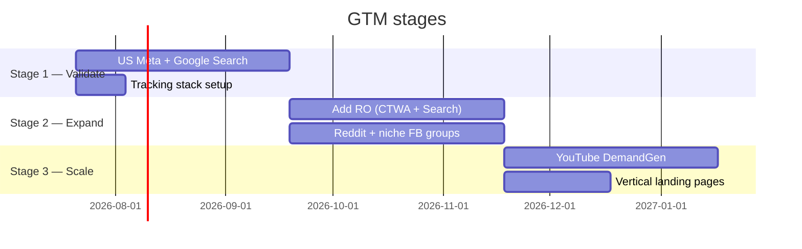

# 05 — GTM & scale (≈8–12 weeks)

> **Goal:** prove the unit economics work — for one ad channel, in one geography, on at least one vertical — that CAC < 3× ARPU and trial→paid is north of 8% on Google traffic / 4% on Meta traffic.
>
> **Pre-requisite:** [`04-paid-launch.md`](./04-paid-launch.md) DoD.

The detailed creative + budget strategy lives in [`marketing_strategy.md`](../../marketing_strategy.md). This roadmap doc is the **dev + ops sequencing** — what we have to build, what we have to instrument, what we can finally stop deferring.

---

## Three-stage rollout (mirrors the marketing strategy doc)

---

## Stage 1 — Validate (≈8 weeks)

### Ads (run by the founder or a part-time freelancer)

- **70%** US Meta Reels + Click-to-WhatsApp.
- **30%** US Google Search on bottom-funnel terms.
- Budget: €2,500–€3,500/month per the marketing doc.

**Single creative spike:** "Show your booking screen, show 3 missed calls turning into 3 bookings on WhatsApp." 9:16, phone-shot, 25 seconds, unscripted founder voice-over. Re-cut weekly with variant hooks.

### Dev work (what we must build for GTM-1)

| # | What | Estimate | Why now |
|---|---|---|---|
| **1** | Stape sGTM + Meta Pixel + CAPI (deduplicated) + GA4 + Google Ads Enhanced Conversions for Web | 3 days | The marketing doc is explicit that this is mandatory, not optional. Without CAPI we lose 20–30% of attribution. |
| **2** | A `request_demo` event + `signup` event + `trial_started` event + `subscribed` event fired both client-side and server-side with the same `event_id` | 1 day | The four points that matter for ad optimisation. |
| **3** | A "Try the AI now" button on the landing page that launches a Click-to-WhatsApp link directly into the founder's pre-seeded demo number | 1 day | This is the highest-converting first-touch experience for a WhatsApp product. The AI does the demo. |
| **4** | UTM-aware signup tracking (capture `utm_source/medium/campaign` on `User` at first sign-in) | half day | So we can join paid spend to MRR per channel. |
| **5** | Cookie consent banner with GCM v2 (Iubenda or Cookiebot) | half day | GDPR-mandatory once we run ads to EU. |
| **6** | Two landing-page variants per vertical (only the top 2 paying verticals from the pilot) | 2 days each | The marketing doc covers cross-domain tracking if we go subdomain — we won't yet. Use `/v/barber`, `/v/auto-repair` paths. |

### Ops work

- A weekly hour reviewing the **Marketing Sheet**: spend per channel, signups, paid conversions, CAC, MRR added. Calculated by hand for the first month.
- A founder-only WhatsApp number ringing through to the demo AI — every prospect who clicks CTWA talks to it. The AI converts them to a real signup with a follow-up link.

---

## Stage 2 — Expand to Romania (≈4 weeks)

Triggered when **Stage 1** CAC < 3× ARPU on at least one ad set with ≥10 paying customers.

### Ads

- Localise the winning US creative into Romanian: re-shoot with a Romanian-speaker, do not translate. The marketing doc is emphatic about this.
- Add `/v/frizerie`, `/v/manichiura`, `/v/toaletaj-canin` landing variants.
- 30/70 RO/US split. Total budget €4,000–€6,000.

### Dev work (only what's specifically required for RO)

| # | What | Why now |
|---|---|---|
| 1 | RO-language landing pages | Cheap, the founder writes the copy. |
| 2 | Multilingual AI replies — proper. Replace the "reply in same language" one-liner with a proper system prompt addendum + a forced-language override on `BusinessProfile.preferredLanguage`. | First-touch Click-to-WhatsApp chats need to be unambiguously Romanian. |
| 3 | RO-specific WhatsApp template approval — re-submit reminders, confirmations, and dunning templates in Romanian. | Meta-template approval is per-language. |
| 4 | RON currency display on tenant invoices (already handled if `BusinessProfile.currency = RON`). | Cosmetic. |
| 5 | RO-localised onboarding (translate the eight key screens) | Lower friction on RO signups. |

### Ops work

- Add Reddit Pixel ($300/mo test budget per marketing doc).
- Engage in 2–3 vertical FB groups per week. **Comment helpfully, don't pitch.**

---

## Stage 3 — Scale (≈4 weeks+)

Triggered when **Stage 2** Romania CPL < €15 and trial→paid > 8% on either geography.

### Ads

- Add YouTube Demand Gen with Custom Intent audiences seeded from the search keywords.
- Per-vertical landing pages on `bookme.ai/v/X` (or subdomains if cross-domain tracking is worth it — probably not yet).
- Expand Reddit; trade publications start to make sense.

### Dev work

| # | What | Why now |
|---|---|---|
| 1 | PostHog for product analytics + funnel — signup → activation → paid | At this scale we need to see retention cohorts, not just totals. |
| 2 | A real `/admin` dashboard — MRR, cohort retention, support-load, agent error-rate | The Discord pipe stops scaling at ~30 tenants. |
| 3 | Founder-side support tooling — a /admin/tenant/[id] page with a "act as tenant" button, agent message history, recent appointments, last few errors | Cuts support time per ticket by ~70%. |
| 4 | Re-evaluate Solution Partner / Twilio Sub-account migration | We now have data on the messaging-cost markup story. |

### Ops work

- First hire if MRR > €15k/mo: a part-time customer success person who speaks Romanian and English. **Not an engineer first.** Engineering throughput is not the bottleneck at this stage; onboarding hand-holding is.

---

## What we deliberately defer until **after** Stage 3 unit economics are proven

| Item | Defer reason |
|---|---|
| Unit / integration / E2E tests | This is the moment they finally matter. See [`06-post-gtm-hardening.md`](./06-post-gtm-hardening.md). |
| Customer entity model | Same. |
| Multi-channel (Messenger / IG / SMS) | Stage 3 retention data tells us whether it's worth it. |
| Mobile app | Probably never. |
| White-label / agency reseller | Stage 3+, and only if a partner explicitly asks. |
| Token overage **billing** (not metering, which is built) | Wait until at least one tenant exceeds allowance for two months in a row. |

---

## What can go wrong + the cheapest test for each

| Risk | Cheapest signal | Mitigation if it triggers |
|---|---|---|
| Stage-1 CAC > 5× ARPU on Meta | Hit at €2k spend with no winning ad set | Cut Meta, double Google Search, re-cut creative. |
| Click-to-WhatsApp ads land but the AI demo confuses prospects | Drop-off after first AI message in CTWA chats | Tighten demo prompt — make the AI introduce itself as "the BookMe AI demo" and give a clear "type 'YES' to schedule" CTA. |
| Trial→paid <2% across all channels | After 50 signups | The product, not the channel, is the problem. Pause ads, run a customer-interview week. |
| WhatsApp quality rating drops on tenant numbers | Tenant-side WABA red banner | Pause CTWA, audit conversations for spammy patterns, throttle templates. |
| ANAF rejects e-Factura uploads (RO) | Cron job alerts | Manual upload via SPV web while we debug. |
| Revolut autopay churn (silent failures) | `PAST_DUE` count > 5% | Tighten the dunning sequence; consider a backup processor (Stripe) for Stage 3+. |

---

## Definition of Done

This stage is unlike the earlier stages — there's no engineering "DoD". The gate is **commercial**:

- [ ] At least one ad set, on one platform, in one geography, has produced ≥20 paying customers with CAC < 3× ARPU.
- [ ] Trial→paid ≥ 8% on Google Search traffic on at least one vertical.
- [ ] MRR has been growing month-over-month for 8 weeks.
- [ ] Founder is no longer the bottleneck for onboarding (waitlist time-to-onboard < 24h sustained).

When **all four** are true, the business is validated. Only then do we move to [`06-post-gtm-hardening.md`](./06-post-gtm-hardening.md).
