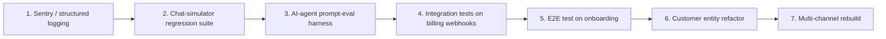

# 06 — Post-GTM hardening

> **Trigger:** [`05-gtm-and-scale.md`](./05-gtm-and-scale.md) DoD. Unit economics proven.
>
> **Goal:** stop accumulating tech debt. Stay alive at scale.

Until this point the founder principle has been: **dev speed > correctness, no tests, no abstractions, no infrastructure beyond the smallest thing that works.** That principle was right. It's now wrong.

The reason it flips: a customer churning because a regression broke booking on Tuesday costs more in MRR than a week of test scaffolding costs in dev time. Below that scale, tests cost more than they save.

---

## Order of work, by ROI



### 1. Sentry + structured logging (1 week)

The Discord webhook ran out of steam at ~30 tenants. Replace with Sentry on errors, structured JSON logs to a single sink (BetterStack, Logflare, or Vercel's built-in log drain). Don't pay for Datadog.

### 2. Chat-simulator regression suite (1–2 weeks)

This is **not** unit tests — it's a thin script (`npm run test:agent`) that runs ~30 named conversations through the chat simulator and asserts on the outputs ("did `book_appointment` fire", "did the AI ask for the customer's name"). Each conversation is a markdown file under `tests/agent-scenarios/`.

Why this comes before traditional unit tests: 80% of our bugs are agent-prompt regressions. A 30-scenario harness catches them. Unit tests of `getAvailability` would catch ~0.

### 3. AI-agent prompt-eval harness (1–2 weeks)

A nightly cron that:

- Replays the chat-simulator suite against the current `main` branch.
- Compares output diffs against a manually-curated baseline.
- Posts a diff report to Discord.

When we change the system prompt, we **see** the regressions.

### 4. Integration tests on billing webhooks (1 week)

Revolut webhooks, Meta webhooks, ANAF e-Factura status polls. These are the only places where a silent failure costs us money or compliance. Vitest with a real Postgres test DB and mocked HTTP.

### 5. E2E test on onboarding (1 week)

Playwright. The full Google → Profession → WhatsApp connect → first conversation flow. **One** test that's allowed to be flaky in CI as long as it passes locally on the founder's machine before each release.

### 6. Customer entity refactor (2 weeks)

Replace `(userId, customerPhone)` with a first-class `Customer` model. Reasons:

- A returning customer should not need to re-state their name every booking.
- Analytics — "how many bookings per customer per quarter" is the retention metric that matters.
- Multi-channel — once we add Instagram DMs, the identity model needs `Customer ↔ ChannelIdentity[]`.

```prisma
model Customer {
  id        String   @id @default(cuid())
  userId    String
  name      String?
  email     String?
  language  String?
  notes     String?
  createdAt DateTime @default(now())
  appointments Appointment[]
  channelIdentities CustomerChannelIdentity[]
}
model CustomerChannelIdentity {
  id          String @id @default(cuid())
  customerId  String
  channel     String  // 'whatsapp' | 'instagram' | 'messenger' | 'sms' | 'email'
  externalId  String  // E.164, PSID, IGSID, etc.
  @@unique([channel, externalId])
}
```

Migration is the careful part; one transaction per tenant, idempotent. Keep the old fields populated until the migration runs everywhere.

### 7. Multi-channel rebuild (3–6 weeks per new channel)

Only after Customer entity ships. The messaging-channels-strategy doc still applies — **don't add a second chat channel unless a paying segment demands it.** The order if we do:

1. **Outbound email confirmations / reminders / receipts** — done in [`04-paid-launch.md`](./04-paid-launch.md).
2. **Instagram DM** — only for beauty verticals with strong IG presence.
3. **Messenger** — for restaurants if we ever expand to that vertical.
4. **SMS reminders** — only as a one-way fallback for tenants whose customers don't use WhatsApp (rare in RO, more common in some US states).

---

## Other things we finally do at this stage

| Item | Why now |
|---|---|
| Per-tenant rate limiting on `processWhatsAppMessage` | At scale, one buggy tenant prompt loop can run up €100 in tokens overnight. |
| **Token overage billing** (charging, not just metering) | Some tenant will exceed; we should charge them. |
| Full `Appointment` workflow: `no_show`, `completed`, internal notes | Tenants now ask for this; it underpins retention analytics. |
| Tenant-side drag-to-reschedule UI | A real UI on top of the existing tool. |
| Real analytics dashboard | Replace `/admin/customers` glance with charts. |
| Solution Partner migration / Twilio Sub-account migration | If the data says markup on WhatsApp messaging is worth the credit risk. |
| Second processor (Stripe) as backup | If Revolut autopay churn > 5%. |
| Localised legal docs | Per-country ToS / PP. |
| Hiring | First customer success, then full-stack engineer #2. Engineering throughput is rarely the constraint. |

---

## What we still don't do, even now

- Microservices.
- A separate worker tier.
- A mobile app.
- A dedicated CDP (Segment / RudderStack) — PostHog is enough.
- An ESB / event bus.
- Kubernetes.
- A separate billing service.

The whole app is still one Next.js monolith on Vercel + Supabase + Resend + Revolut + (maybe) Stripe. **That is by far the right answer at $50k MRR and likely up to $500k MRR.**

---

## Definition of Done

There is no DoD for this stage. Hardening is continuous. The signal that this stage is "ongoing healthily":

- Sentry shows < 1 error per 100 booking conversations.
- Chat-simulator regression suite is run on every PR.
- One major refactor (e.g. Customer model) is shipped per quarter without breaking existing tenants.
- Founder spends < 20% of week on support; rest is product or growth.
