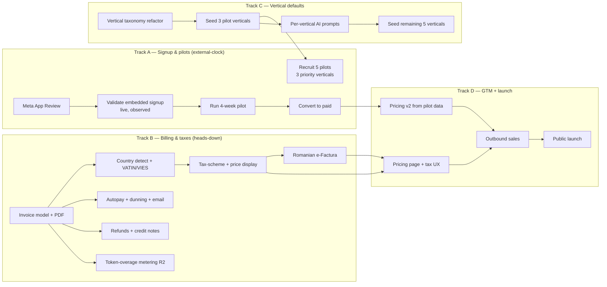
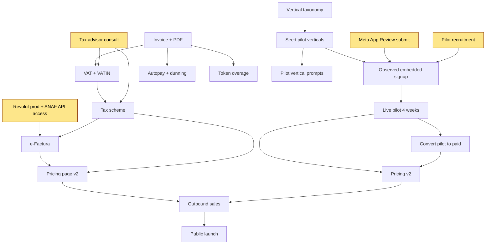
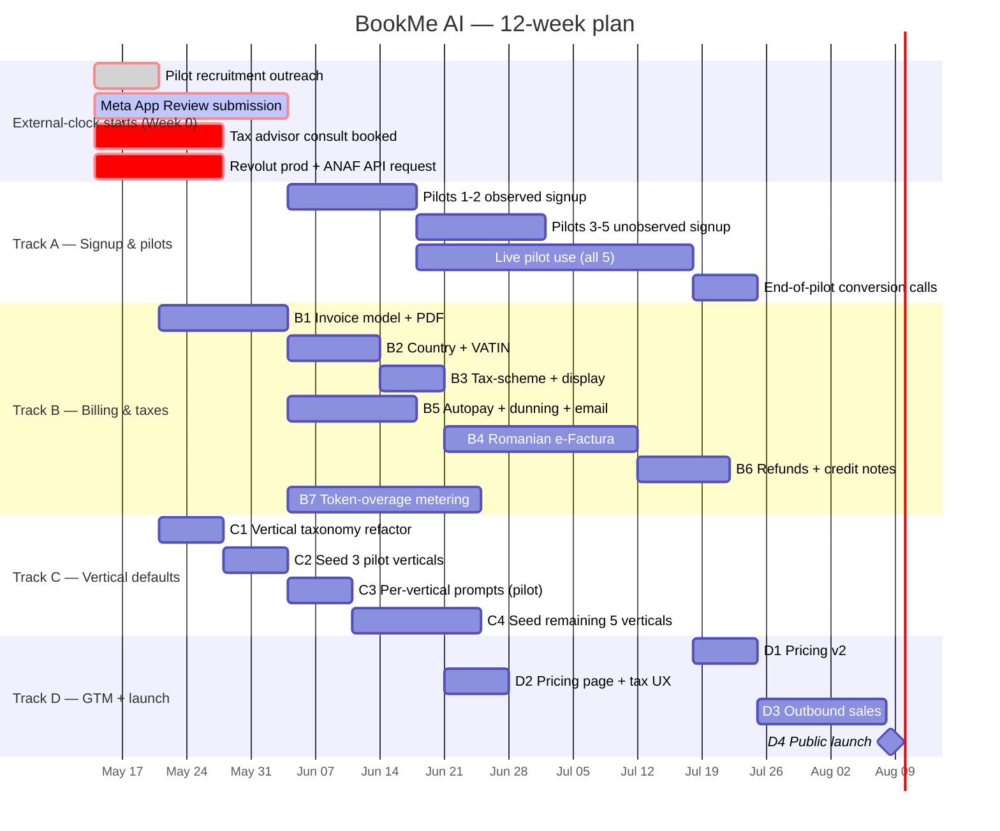
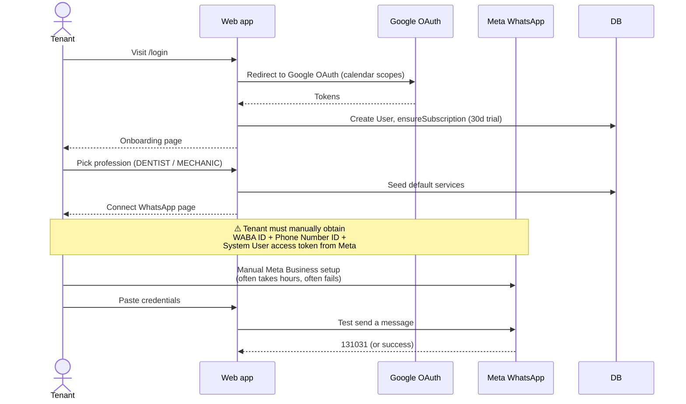
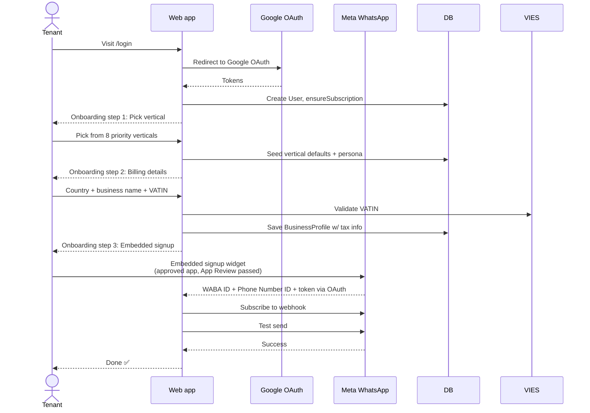
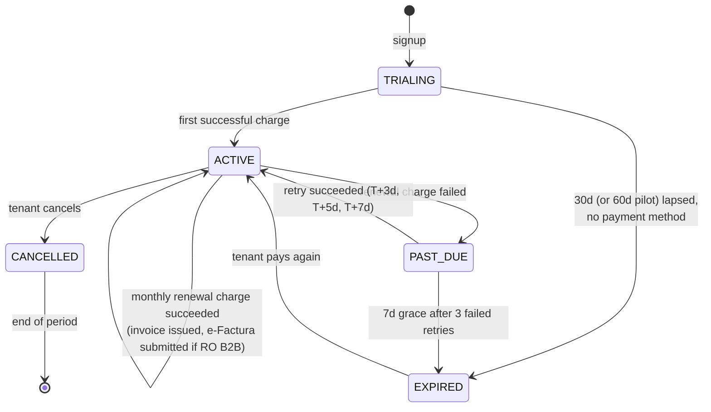
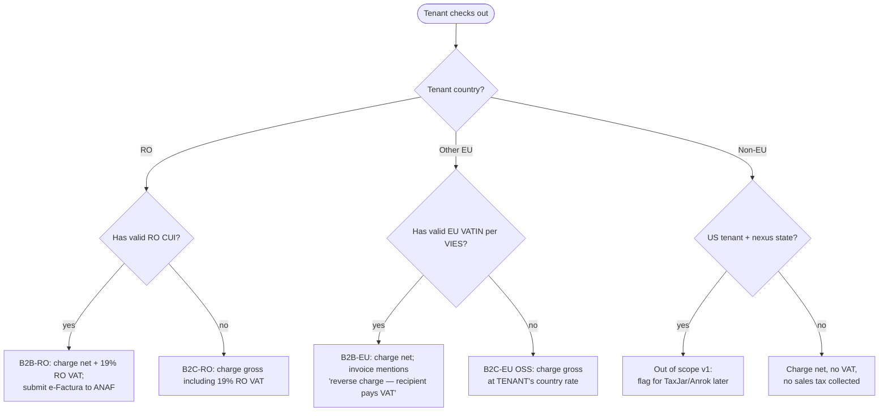
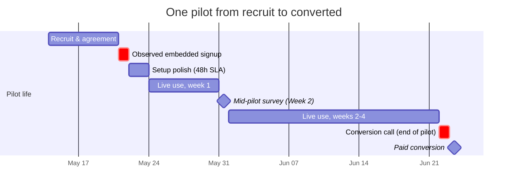

# 08 — Diagrams

All roadmap diagrams in one place, in Mermaid (renders natively on GitHub, in most Markdown viewers, and in the Cursor / VS Code preview).

If a diagram does not render where you are looking at this, paste the fenced ```mermaid``` block into <https://mermaid.live>.

---

## 1. Parallel tracks (high-level)



---

## 2. Dependency graph (what blocks what)



Yellow nodes are external-clock dependencies. They all start Week 0.

---

## 3. 12-week Gantt



`crit` rows are the critical path. If any of them slip, the launch date slips.

---

## 4. Tenant signup flow (current vs target)

### 4.1 Current



### 4.2 Target (post-Track-A)



The target flow is what Track A §4 + Track B §B2 + Track C §4 jointly produce.

---

## 5. Billing lifecycle (target, post-Track-B)



---

## 6. Tax-scheme decision (target, post-B3)



---

## 7. Per-pilot timeline


