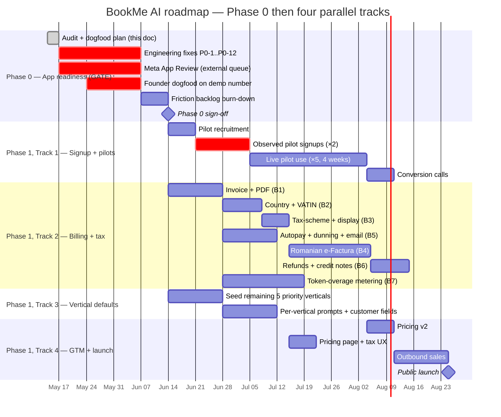

> Today's date: **2026-05-14**.
>
> **Read this first:** we are not in pilot mode yet, and we cannot start pilots, billing-hardening, or GTM until we have *proven the app works end-to-end ourselves*. That is Phase 0. Phase 0 is the gate; everything else is gated behind it.

# BookMe AI — Product & Business Roadmap

This roadmap takes BookMe AI from "we shipped a lot of code; we have not proven any of it works under realistic conditions" to "we have paying tenants on a billing stack that handles taxes, on a validated WhatsApp signup, with defaults for the verticals we want to win."

It is split into **two stages**:

1. **Phase 0 — App dev-readiness.** A comprehensive audit, a fix list, and a 2-week founder dogfood that ends with a written go/no-go. **Pilots, billing rework, GTM all wait on this.**
2. **Phase 1 — Four parallel tracks.** Pilot validation, billing+tax, vertical expansion, GTM/launch. These run in parallel so we are not blocked, and only begin once Phase 0 is signed off.

The full document set:

| File | What it is | Phase |
|---|---|---|
| [`README.md`](./README.md) (this file) | Executive view, sequencing, success metrics | both |
| [`00-phase-0-app-readiness.md`](./00-phase-0-app-readiness.md) | **Phase 0** — audit of what's built, the 12 critical flows, the 12 fixes, founder dogfood, sign-off | **0** |
| [`01-parallel-tracks.md`](./01-parallel-tracks.md) | How the four Phase-1 tracks interlock | 1 |
| [`02-track-a-whatsapp-signup-pilots.md`](./02-track-a-whatsapp-signup-pilots.md) | Track 1 — WhatsApp embedded signup validation + free pilots | 1 |
| [`03-track-b-billing-taxes.md`](./03-track-b-billing-taxes.md) | Track 2 — Billing hardening, VAT/sales-tax, invoicing, dunning | 1 |
| [`04-track-c-vertical-defaults.md`](./04-track-c-vertical-defaults.md) | Track 3 — Defaults for the 8 priority verticals | 1 (partial in 0) |
| [`05-track-d-gtm-launch.md`](./05-track-d-gtm-launch.md) | Track 4 — Pricing finalisation, sales motion, launch | 1 |
| [`06-pilot-playbook.md`](./06-pilot-playbook.md) | The pilot program: who, how, what we measure, exit criteria | 1 |
| [`07-risks-and-open-decisions.md`](./07-risks-and-open-decisions.md) | What we have not decided yet and where it bites us | both |
| [`08-diagrams.md`](./08-diagrams.md) | Flows, Gantt, dependency graph | both |

---

## 1. Where we are honestly today

| Area | State | Source of truth |
|---|---|---|
| **End-to-end "it works" proof** | **None.** Code is shipped; no dogfood diary, no smoke test, no founder has used it on a real demo number for two weeks. | n/a — gap |
| **Automated tests** | **Zero** files matching `*.test.*` / `*.spec.*` in repo. | n/a — gap |
| **Meta App Review status** | **Unknown to this document.** We have a 131031 error troubleshooting note on file, which suggests we have hit Meta-side issues already. | [`whatsapp-error-131031-troubleshooting.md`](../../whatsapp-error-131031-troubleshooting.md) |
| Conversational channel | WhatsApp-only (Meta Cloud API + Twilio). Outbound email not built. | `src/lib/whatsapp/`, [`docs/messaging-channels-strategy.md`](../messaging-channels-strategy.md) |
| Onboarding | Google sign-in → pick `Profession` (DENTIST or MECHANIC only) → connect WhatsApp. | `src/app/onboarding/page.tsx` |
| Tenant WhatsApp connection | Manual paste OR embedded-signup endpoint exists — **embedded signup not validated end-to-end with a real third-party tenant.** | `src/app/api/whatsapp/embedded-signup/` |
| Billing | Revolut Hosted Checkout, $25 USD/month, 30-day trial, autopay scaffold. **Not observed running end-to-end in production**: no live $1 charge, no live autopay renewal, no dunning to EXPIRED. Single tier. No invoices. No taxes. | [`REVOLUT_INTEGRATION.md`](../../REVOLUT_INTEGRATION.md), `src/lib/subscription.ts` |
| Tax | **None.** $25 charged flat. | n/a — gap |
| Defaults per vertical | Only `DENTIST` and `MECHANIC` seeded. Excel lists 55 verticals, 8 are "Priority 1". | `src/lib/defaults.ts`, [`259195d5-bookmeaiverticals.xlsx`](../../../) |
| Real paying tenants | **Zero.** | n/a |
| Token / LLM metering | Defined in `docs/app-overview.md` as R2 revenue source; **not implemented**. | `docs/app-overview.md` §3.2 |
| Webhook signature verification on inbound WhatsApp | **Helper exists, not called in the route.** Any HTTP client can POST a forged message. | [`src/lib/whatsapp/meta-provider.ts`](../../src/lib/whatsapp/meta-provider.ts), [`route.ts`](../../src/app/api/webhooks/whatsapp/route.ts) |
| Two-way Google Calendar sync | App writes events outbound; **tenant-side calendar edits / cancellations are not picked up.** | [`src/lib/google-calendar.ts`](../../src/lib/google-calendar.ts) |
| Booking concurrency | **No guard.** Two simultaneous bookings for the same slot can both succeed. | [`src/lib/ai-agent.ts`](../../src/lib/ai-agent.ts) `book_appointment` |

Phase 0 exists to turn this list from "untested" to "demonstrated working".

---

## 2. The two stages, in one sentence each

- **Phase 0 (now → ~6 weeks):** founders use BookMe AI on a real Meta WhatsApp number for two weeks on a real fake-business demo, while the engineering team ships the 12 named fixes from [`00-phase-0-app-readiness.md`](./00-phase-0-app-readiness.md). We end with a written sign-off saying "yes, a stranger can use this end-to-end without breaking it."
- **Phase 1 (Weeks 6→18):** four parallel tracks — pilots, billing+tax, vertical defaults, GTM — running concurrently so external-clock work (pilot recruiting, Meta App Review, tax advisor) is not blocked by internal-clock work (e-Factura, autopay hardening, invoice PDFs), or vice versa.

---

## 3. The two-stage timeline

Note Track 3 *partially* lands inside Phase 0 (the vertical taxonomy + the 3 pilot verticals), because dogfooding as a barber requires the barber vertical to exist. The remaining 5 verticals ship in Phase 1.

---

## 4. Strategic principle: never wait

Unchanged from the prior version, with Phase 0 layered on top:

- **Anything that needs an external party to give us feedback** (Meta App Review queue, tax advisor, future pilots) starts as early as possible — including during Phase 0 — because its calendar time is outside our control.
- **Anything we can build heads-down with no external dependency** is sequenced *behind* the external-dependency starters but runs in parallel with them.
- **Phase 0 itself respects the rule:** we submit Meta App Review on Day 1 of Phase 0 even though we will not need it until Phase 1, because the review queue is the slowest thing in the whole roadmap.

The user-stated principle ("while friendly businesses test in their practice for free, we focus on billing") applies inside Phase 1. Phase 0 has no friendly businesses yet — we are the friendly business.

---

## 5. Success metrics

### 5.1 Phase 0 sign-off (the gate)

See [`00-phase-0-app-readiness.md`](./00-phase-0-app-readiness.md) §5. In short: all 12 critical flows demonstrated, all 12 fixes shipped, smoke test green, dogfood diary populated, one live $1 charge cycled end-to-end including refund.

### 5.2 Phase 1, at Week 18

We will judge Phase 1 successful when **all five** are true:

1. **Signup works for non-technical tenants without us on a call.** ≥80% of pilot embedded-signup attempts complete without a human intervention from us.
2. **We can invoice anyone in our target geographies legally.** A Romanian barber, a German nail tech, and a US auto shop can each receive a tax-correct invoice.
3. **At least 3 of 5 pilots convert to paid** at the end of their free period.
4. **We have ≥1 paying tenant in ≥3 distinct priority verticals.**
5. **Zero manual interventions per renewal cycle** in the typical case.

---

## 6. Out of scope (12 weeks of Phase 1)

- **New conversational channels** (Instagram DMs, Messenger, SMS as a full second channel). See [`docs/messaging-channels-strategy.md`](../messaging-channels-strategy.md).
- **Annual prepay, white-label, agency reseller.** Future revenue per `docs/app-overview.md` §3.3; not in next 18 weeks.
- **Multi-language dashboard beyond EN.** AI receptionist already speaks RO/EN by config; the dashboard stays EN.
- **A third LLM provider.**
- **Mobile apps.** Tenants use the web dashboard; customers use WhatsApp.

---

## 7. How to read the rest

If you are…

- **A founder deciding what we work on this week** → read this file + [`00-phase-0-app-readiness.md`](./00-phase-0-app-readiness.md). Until Phase 0 is signed off, the rest of the docs are reference material, not instructions.
- **An engineer picking up a card** during Phase 0 → read [`00-phase-0-app-readiness.md`](./00-phase-0-app-readiness.md) §3 (the 12 fixes) and grab one.
- **An engineer picking up a card** during Phase 1 → read the track file you are on (`02`–`05`) and [`08-diagrams.md`](./08-diagrams.md). But check the gate is green first.
- **Doing outreach to pilots** → DO NOT start until Phase 0 is signed off. Then read [`06-pilot-playbook.md`](./06-pilot-playbook.md).
- **A tax advisor or accountant we are briefing** → read [`03-track-b-billing-taxes.md`](./03-track-b-billing-taxes.md) §2 and §3. (Yes, you can be briefed during Phase 0 — the consult is an external-clock starter.)
- **An investor or partner asking "what is your plan"** → read this file end-to-end, plus [`07-risks-and-open-decisions.md`](./07-risks-and-open-decisions.md).
