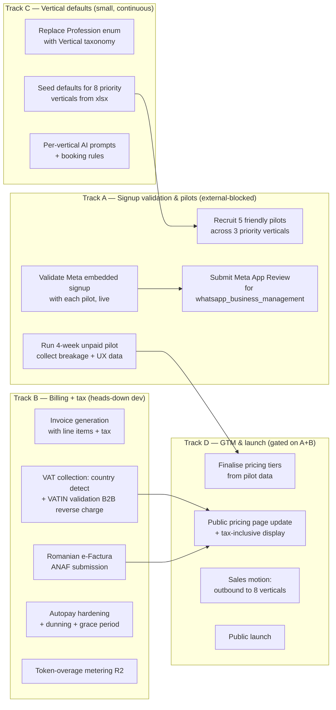

> Today's date: **2026-05-14**. All "Week N" references are calendar weeks counted from this date unless stated otherwise.

# BookMe AI — Product & Business Roadmap

This roadmap takes BookMe AI from "we are a tech provider" to "we have paying tenants on a billing stack that handles taxes, with a validated WhatsApp signup, defaults for the verticals we actually want to win."

It is organised as **four tracks that run in parallel** so we are never blocked waiting on one thing. The single most important principle is:

> **While friendly pilots stress-test the product for free in their practice, we build the billing + tax + invoicing stack. By the time pilots are done validating, billing is ready to charge them.**

The full document set:

| File | What it is |
|---|---|
| [`README.md`](./README.md) (this file) | Executive view, parallel tracks, timeline, success metrics |
| [`01-parallel-tracks.md`](./01-parallel-tracks.md) | How tracks interlock; what unblocks what |
| [`02-track-a-whatsapp-signup-pilots.md`](./02-track-a-whatsapp-signup-pilots.md) | Track A — WhatsApp embedded signup validation + free pilots |
| [`03-track-b-billing-taxes.md`](./03-track-b-billing-taxes.md) | Track B — Billing hardening, VAT/sales-tax, invoicing, dunning |
| [`04-track-c-vertical-defaults.md`](./04-track-c-vertical-defaults.md) | Track C — Defaults for the 8 priority verticals |
| [`05-track-d-gtm-launch.md`](./05-track-d-gtm-launch.md) | Track D — Pricing finalisation, sales motion, launch |
| [`06-pilot-playbook.md`](./06-pilot-playbook.md) | Concrete pilot program: who, how, what we measure, exit criteria |
| [`07-risks-and-open-decisions.md`](./07-risks-and-open-decisions.md) | What we have not decided yet and where it bites us |
| [`08-diagrams.md`](./08-diagrams.md) | All diagrams (flows, gantt, dependency graph) in one place |

---

## 1. Where we are today (honest snapshot)

| Area | State | Source of truth |
|---|---|---|
| Conversational channel | WhatsApp-only (Meta Cloud API + Twilio). Outbound email not built. | `src/lib/whatsapp/`, [`docs/messaging-channels-strategy.md`](../messaging-channels-strategy.md) |
| Onboarding | Google sign-in → pick `Profession` (DENTIST or MECHANIC only) → connect WhatsApp manually. | `src/app/onboarding/page.tsx`, `prisma/schema.prisma` (`Profession` enum) |
| Tenant WhatsApp connection | Manual paste of Phone Number ID + WABA ID + System User token, or Twilio creds. **Embedded signup endpoint exists (`src/app/api/whatsapp/embedded-signup`) but has not been validated end-to-end with a real non-technical tenant.** | `src/app/api/whatsapp/embedded-signup/`, `whatsapp-error-131031-troubleshooting.md` |
| Billing | Revolut Hosted Checkout, $25 USD/month, 30-day trial, autopay scaffold (`src/lib/revolut-autopay.ts`). Single tier. No invoices. No taxes. | [`REVOLUT_INTEGRATION.md`](../../REVOLUT_INTEGRATION.md), `src/lib/subscription.ts` |
| Tax | **None.** $25 charged flat. No VAT collection, no VATIN validation, no invoice with tax breakdown, no Romanian e-Factura, no US sales tax. | n/a — gap |
| Defaults per vertical | Only `DENTIST` and `MECHANIC` seeded in `src/lib/defaults.ts`. Excel lists 55 verticals, 8 of which are "Priority 1". | `src/lib/defaults.ts`, [`259195d5-bookmeaiverticals.xlsx`](../../../) |
| Real paying tenants | **Zero.** | n/a |
| Token / LLM metering | Defined in `docs/app-overview.md` as R2 revenue source; **not implemented**. | `docs/app-overview.md` §3.2 |

The two things blocking revenue:
1. **We do not know if a non-technical barber, nail tech, or vet can actually connect their WhatsApp without our hand-holding.** Embedded signup is shipped code, not validated UX.
2. **We cannot legally invoice EU/RO customers properly.** Charging $25 with no VAT and no invoice is acceptable for 1–2 friendly pilots but is not acceptable as soon as we have a real B2B customer with an accountant.

Everything in this roadmap is sequenced around resolving those two, in parallel, without letting either block the other.

---

## 2. Strategic principle: never wait

The user-stated principle (paraphrased): *"While friendly businesses test in their practice for free, we focus on billing."*

Generalised:

- **Anything that needs an external party to give us feedback** (pilots, designers, accountants, Meta App Review, tax advisor) goes first because its calendar time is outside our control.
- **Anything we can build heads-down with no external dependency** (billing, tax, defaults, invoicing) is sequenced *behind* the external-dependency starters but runs in parallel with them.
- **External-blocking work is queued early even if its prerequisites are not 100% ready.** Sending the Meta App Review submission with one rough screencast on day 7 is better than waiting two weeks for a polished one because the *review queue itself* is the slow thing.

This produces the four-track structure below.

---

## 3. The four tracks at a glance

Diagrams in higher fidelity (Gantt, dependency, signup flow, billing flow) are in [`08-diagrams.md`](./08-diagrams.md).

---

## 4. Timeline — 12 weeks

This is the *target*. Items in **bold** are external-dependency starters and must be kicked off Week 1 regardless of internal readiness.

### Phase 0 — Week 0 (this week)

- **Lock pilot ICP**: pick 3 of the 8 "Priority 1" verticals to focus on. Recommended first cut: **barber shops, nail salons, independent auto repair** (see [`07-risks-and-open-decisions.md`](./07-risks-and-open-decisions.md) §D1).
- **Open pilot outreach**: warm intros to 8–10 candidate businesses to land 5 pilots. The "do we know any X who would test for free?" question gets asked to founders' networks today.
- **Engage a tax advisor** (1-hour paid consult) on RO + EU VAT + invoicing obligations for a USD-charging SaaS billed via Revolut Business RO. This is a calendar-blocked input for Track B — start it now.
- **Submit Meta App Review** for `whatsapp_business_management` permission if not already approved. Review queue is 1–3 weeks and gates the embedded-signup flow for production traffic.

### Phase 1 — Weeks 1-4 (parallel run)

| Track | Deliverables |
|---|---|
| **A — Signup + pilots** | 5 pilots signed (free 60 days). 5 live embedded-signup attempts observed end-to-end. Friction log per pilot. |
| **B — Billing + tax** | Invoice model + PDF generation in code. Country/VAT detection at checkout. VATIN validation via VIES. Tax-inclusive vs tax-exclusive display logic. |
| **C — Vertical defaults** | `Profession` enum migrated to `Vertical` taxonomy. Defaults seeded for 3 pilot verticals (barbers, nails, auto). Per-vertical system prompt scaffolding. |
| **D — GTM** | Public website copy updated to speak the 3 pilot verticals' language, not "dentists and mechanics." |

### Phase 2 — Weeks 5-8

| Track | Deliverables |
|---|---|
| A | Pilots in full use. Weekly check-ins. Mid-pilot survey. Breakage backlog burned down to zero P0/P1. |
| B | Romanian e-Factura submission (ANAF) wired. Autopay dunning + grace period. Refund/credit-note flow. |
| C | Defaults seeded for the remaining 5 priority verticals. Per-vertical prompts validated on chat simulator. |
| D | Pricing model v2 drafted based on pilot signal (single tier vs tiered, included tokens, overage). |

### Phase 3 — Weeks 9-12

| Track | Deliverables |
|---|---|
| A | Pilots convert to paid (target: ≥3 of 5). Each pilot becomes a case study + reference. |
| B | Token-overage metering live. End-to-end production billing run: invoice → VAT → e-Factura → autopay → dunning. |
| C | All 8 priority verticals shipped with defaults, prompts, and at least one tenant per vertical (where possible). |
| D | Public launch. Outbound sales to the 8 verticals using pilot case studies as proof. |

A visual Gantt is in [`08-diagrams.md`](./08-diagrams.md#gantt).

---

## 5. Success metrics

We will judge this roadmap successful at Week 12 if **all five** are true:

1. **Signup works for non-technical tenants without us on a call.** ≥80% of pilot embedded-signup attempts complete without a human intervention from us.
2. **We can invoice anyone in our target geographies legally.** A Romanian barber, a German nail tech, and a US auto shop can each receive a tax-correct invoice for their subscription.
3. **At least 3 of 5 pilots convert to paid** at the end of their free period.
4. **We have ≥1 paying tenant in ≥3 distinct priority verticals** (proves the vertical defaults are worth the abstraction).
5. **Zero manual interventions per renewal cycle** in the typical case (autopay + dunning + invoicing all run hands-off).

If any of these fail, the failure mode is informative (see [`07-risks-and-open-decisions.md`](./07-risks-and-open-decisions.md)).

---

## 6. Out of scope for this roadmap

Listed here so we do not get tempted to do them in the next 12 weeks:

- **New conversational channels** (Instagram DMs, Messenger, SMS as a full second channel). See [`docs/messaging-channels-strategy.md`](../messaging-channels-strategy.md).
- **Annual prepay, white-label, agency reseller.** Listed in `docs/app-overview.md` §3.3 as future revenue; not in the next 12 weeks.
- **Multi-language support beyond EN + RO** (the pilot ICP is RO + nearby EU; we will add languages reactively, not preemptively).
- **A second LLM provider beyond Gemini + OpenAI.** We already have the abstraction; we will not add a third until token-overage metering proves we are cost-bound.
- **Mobile apps.** Tenants use the web dashboard; customers use WhatsApp. No app needed.

---

## 7. How to read the rest

If you are…

- **A founder deciding what we work on this week** → read this file + [`01-parallel-tracks.md`](./01-parallel-tracks.md).
- **An engineer picking up a card** → read the track file you are on (`02`–`05`) and [`08-diagrams.md`](./08-diagrams.md).
- **Doing outreach to pilots** → read [`06-pilot-playbook.md`](./06-pilot-playbook.md).
- **A tax advisor or accountant we are briefing** → read [`03-track-b-billing-taxes.md`](./03-track-b-billing-taxes.md) §2 and §3.
- **An investor or partner asking "what is your plan"** → read this file end-to-end, plus [`07-risks-and-open-decisions.md`](./07-risks-and-open-decisions.md).
