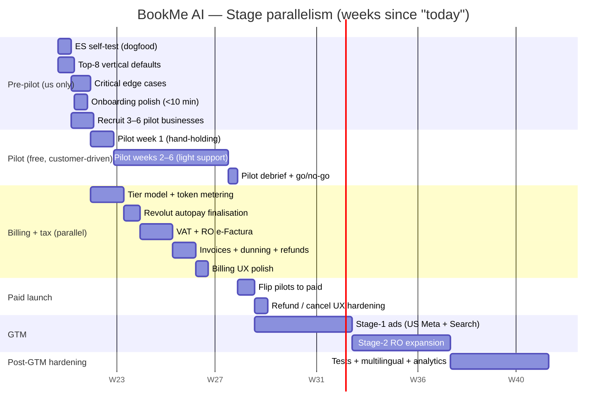
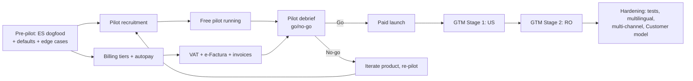

# BookMe AI — Roadmap

> **Mental model:** we are pre-pilot. The single most expensive thing we can do is waste a calendar week being blocked by something a friendly business owner could have been testing for us. **Every decision in this roadmap optimises for "what unblocks the most people in parallel."**

## Index

| # | Doc | Stage | Who's blocked while this runs |
|---|---|---|---|
| 0 | [00-principles-and-current-state.md](./00-principles-and-current-state.md) | — | — |
| 1 | [01-pre-pilot.md](./01-pre-pilot.md) | **Pre-pilot (≈2 weeks)** | We are blocking ourselves and pilots |
| 2 | [02-pilot.md](./02-pilot.md) | **Free pilot (4–8 weeks)** | Customers exercising the product |
| 3 | [03-billing-and-tax.md](./03-billing-and-tax.md) | **Runs in parallel with pilot** | Nobody — pilots don't need billing |
| 4 | [04-paid-launch.md](./04-paid-launch.md) | **Convert pilots → paid (1–2 weeks)** | — |
| 5 | [05-gtm-and-scale.md](./05-gtm-and-scale.md) | **GTM (8–12 weeks)** | — |
| 6 | [06-post-gtm-hardening.md](./06-post-gtm-hardening.md) | **After GTM proves unit economics** | — |
| A | [defaults-by-vertical.md](./defaults-by-vertical.md) | Pre-pilot deliverable | Pilot recruitment |
| B | [billing-architecture.md](./billing-architecture.md) | Stage 3 deliverable | Paid launch |
| C | [risks-and-decisions.md](./risks-and-decisions.md) | Living doc | Anything blocked on an open question |

Diagrams live under [`diagrams/`](./diagrams/) and are also embedded inline below.

---

## TL;DR — the whole plan in five sentences

1. **Pre-pilot (≈2 weeks).** Validate WhatsApp Embedded Signup end-to-end ourselves with a throwaway business, ship default services for the top 8 priority verticals from the spreadsheet, fix the small set of edge cases a real customer will hit in week one (reschedule tool, double-sync race, language detection, lunch breaks/holidays), and remove every onboarding step a non-technical owner could trip on.
2. **Pilot (4–8 weeks), in parallel with billing build.** Hand the product **free** to 3–6 friendly businesses in priority verticals — they live their week as if we were a real vendor; we only collect feedback. **No billing logic gates this stage.**
3. **Billing + tax (built in parallel with pilots).** Recurring autopay (already scaffolded), tiered plans with token allowance, overage metering, VAT collection for EU, RO e-Factura (mandatory for any RO B2B paid customer), invoices, dunning, refund policy enforcement. Done by the time pilots finish.
4. **Paid launch (1–2 weeks).** Flip pilots to paid, finish the few customer-facing billing UX pieces, then start GTM (Meta CTWA + Google Search, US-led, RO support).
5. **Post-GTM hardening.** Only after pilots are paid and CAC < 3× MRR on at least one channel: unit/integration tests, multilingual responses, advanced analytics, Customer entity, multi-channel.

---

## High-level critical path (Gantt)

Read horizontally: pilot (`b1`–`b3`) and billing (`c1`–`c5`) run **at the same time**. The pilot does **not** wait for billing; billing does **not** wait for pilot. Both feed paid launch.

---

## Why this ordering — three rules

1. **Customers can validate the product without billing. We can validate billing without customers. Run both in parallel.** Anything that violates this is a planning mistake.
2. **An edge case earns its place pre-pilot only if a friendly customer hits it in week one.** Double-booking from a manual calendar event (their assistant adds a slot by hand) — yes. Multilingual responses — only if the pilot vertical needs it (RO barber: yes; US dentist: no). Tests — no, until after GTM proves the unit economics.
3. **Tech Provider role is "good enough" for the pilot.** Solution Partner upgrade and Twilio Sub-accounts are big commercial bets that should only be paid for once we have signed paying customers and a known messaging-cost markup story. They're documented in [`docs/app-overview.md` §9](../app-overview.md) — do not preempt that decision.

---

## Stage dependency graph

---

## Hard guardrails (from the founder)

- **DEV SPEED IS THE MOST IMPORTANT THING.** If a doc, abstraction, or test does not directly accelerate the next paying customer, do not build it now.
- **No unit / integration tests until after GTM.** "If we start with those we might as well give up." Tests come after we have a sizeable client base **and** know the app can be profitable. (See [`06-post-gtm-hardening.md`](./06-post-gtm-hardening.md).)
- **Edge cases are pre-pilot work only if a real pilot will hit them.** Everything else is deferred. (See the [pre-pilot edge case list](./01-pre-pilot.md#critical-edge-cases).)
- **Pilots are free.** No billing UX gates the pilot. Don't even ask pilots for a card.
- **Tenant does as little as possible.** Each manual step in onboarding is a customer we lose; cut steps before adding features.
- **Trust the spreadsheet for vertical priority.** Top 8 = Priority 1 verticals — barber shops, nail salons, eyelash/PMU, dog grooming, auto repair, tire shops + ITP, MedSpas, physiotherapy. (Dentists are #14 Standard. The current `DENTIST` / `MECHANIC` enum and seed data is a relic of the demo, not the GTM list.)

---

## How to use this roadmap

- Read [`00-principles-and-current-state.md`](./00-principles-and-current-state.md) once, top-to-bottom. Everything else is a reference.
- Open the stage you're currently in. Each stage doc has a **Definition of Done** (DoD) section — that's the only gate. No DoD section is "ship perfect," they are deliberately small.
- When something is unclear, check [`risks-and-decisions.md`](./risks-and-decisions.md). If it's still unclear, **make the cheaper, more reversible decision and keep moving.**

