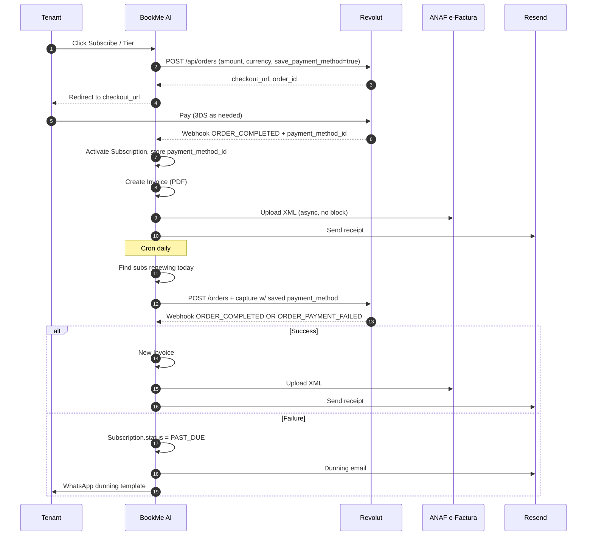
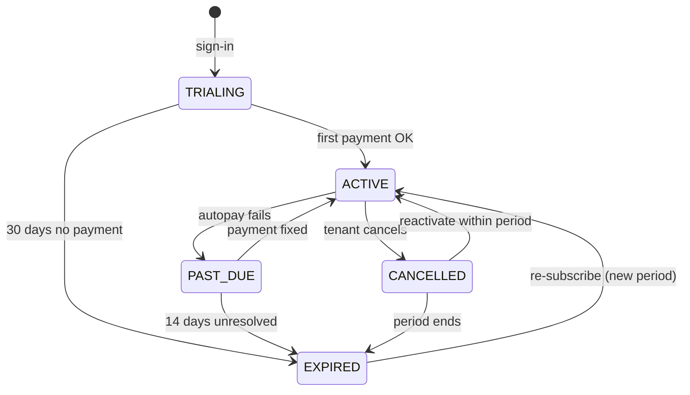

# Appendix B — Billing & tax architecture

> Complementary to [`03-billing-and-tax.md`](./03-billing-and-tax.md). This is the architectural / decision-record side; the stage doc is the build-order side.

---

## 1. Tier table

Three tiers. Round numbers. Token allowance is **what the tier includes**; usage **above** allowance hits overage at provider-cost + Markup (see [`docs/app-overview.md §3.2`](../app-overview.md)).

| Tier | Monthly EUR | Monthly USD | Token allowance / period | Number of WhatsApp numbers | Use case |
|---|---|---|---|---|---|
| **Starter** | €19 | $25 | 50,000 | 1 | Solo operator (barber, nail tech, freelance physio). |
| **Pro** | €39 | $49 | 250,000 | 1 | Multi-chair salon, small clinic, one-bay auto repair. |
| **Business** | €99 | $129 | 1,000,000 | 3 | Multi-location, two-doctor MedSpa, multi-bay shop. |

Annual pricing **deferred** — wait for explicit demand from 3+ tenants. (If you ship it, the discount is 2 months free = 17%.)

### Why not usage-only / per-booking?

Two reasons:

1. Predictability. Service businesses want to budget — "I pay €19" beats "I pay €0.10 per message".
2. Cash-flow. Recurring beats variable. Investors and the founder both prefer it.

If pilot WTP feedback strongly favours per-booking, we revisit — but only after seeing the data.

### Tier allowance sizing — back-of-envelope

For Gemini 2.0 Flash (~$0.10 / 1M input tokens, $0.40 / 1M output tokens; rough ratio 4:1 input:output in our agent):

- 50k tokens ≈ €0.02 LLM cost ≈ ~100 booking conversations.
- 250k tokens ≈ €0.10 LLM cost ≈ ~500 booking conversations.
- 1M tokens ≈ €0.40 LLM cost ≈ ~2,000 booking conversations.

LLM cost as % of tier price is **<1%**, so token allowance is fundamentally a usage-cap mechanism, not a margin lever. Overage is more about protecting against runaway usage than capturing additional revenue. Markup on overage should be **20–30%** above provider cost — explicit, communicated up-front, not a secret margin.

---

## 2. Tax stack — decisions

| Decision | Choice | Why |
|---|---|---|
| Tax engine | **Hand-rolled lookup table for EU; nothing for US** | Stripe Tax wants you on Stripe. Anrok / TaxJar is €100+/month and overkill for 27 fixed VAT rates + reverse-charge logic. The EU rate table changes ~once a year. |
| EU VAT validation | **Direct VIES SOAP call**, cached 30 days | `http://ec.europa.eu/taxation_customs/vies/services/checkVatService`. Free. ~99% uptime. Cache to handle the 1% downtime. |
| RO e-Factura | **Direct SPV API integration** | ANAF's SPV is the only acceptable path for RO B2B. No middleware needed; one OAuth2 client + upload + poll endpoint. |
| Invoice numbering | **Per-legal-entity sequence in `InvoiceSequence` table** | RO law requires gapless monotonic sequence per series; `MT-2026-NNNNN` for SRL, `MTL-2026-NNNNN` for LLC. |
| PDF generation | **`@react-pdf/renderer` server-rendered, stored on Supabase Storage** | Same React skill set we use everywhere. PDFs are deterministic, regenerable. |
| Receipt email | **Resend** | Already a dep. |
| US sales tax | **Defer until $5k/mo US MRR** | Most states don't tax SaaS on the customer's behalf below the small-seller thresholds; we'll deal with nexus when we cross $100k US gross. |

### Why not Stripe?

Three reasons we stay on Revolut for now:

1. **Sunk cost is real but small.** ~3 weeks of integration done.
2. **Revolut has lower fees than Stripe for EU cards** (~1.0% vs ~1.4%).
3. **Revolut autopay is wired and works**.

We re-evaluate Stripe **once** if any of: (a) Revolut autopay churn > 5%, (b) Revolut declines a sandbox-test, (c) a tenant's bank routinely declines our charges.

---

## 3. Money flows — sequence

---

## 4. Invoice shape

Single PDF template, two header variants (SRL / LLC). The fields required for compliance:

| Field | RO B2C | RO B2B (with VAT) | EU B2B (other state, with VAT) | EU B2C (other state) | US | Other |
|---|---|---|---|---|---|---|
| Issuer name + tax ID + address | ✓ | ✓ | ✓ | ✓ | ✓ | ✓ |
| Customer name + (tax ID) + address | ✓ | ✓ | ✓ | ✓ | ✓ | ✓ |
| Invoice number + date | ✓ | ✓ | ✓ | ✓ | ✓ | ✓ |
| Service description | ✓ | ✓ | ✓ | ✓ | ✓ | ✓ |
| Net amount | ✓ | ✓ | ✓ | ✓ | ✓ | ✓ |
| VAT rate | 19% | 19% | 0% | dest. rate | 0% | 0% |
| VAT amount | ✓ | ✓ | 0 | ✓ | 0 | 0 |
| **Mention "reverse charge"** | — | — | ✓ | — | — | — |
| **Mention "out of EU scope"** | — | — | — | — | ✓ | ✓ |
| Total amount | ✓ | ✓ | ✓ | ✓ | ✓ | ✓ |
| Currency | RON or EUR | RON or EUR | EUR | EUR | USD | USD |
| Payment method | "Card via Revolut Merchant" | same | same | same | same | same |
| Customer VAT number | — | ✓ | ✓ | — | — | — |
| Issuer e-Factura "indice incarcare" | ✓ | ✓ | — | — | — | — |

A single React component handles all rows by conditional rendering — keep it boring.

---

## 5. State machine for `Subscription`

This matches what's in `src/lib/subscription.ts` today; we add `PAST_DUE → ACTIVE` (already exists conceptually, needs the UX).

---

## 6. Pricing display rules

The cheapest pricing strategy that survives international customers:

- Display in **EUR** to EU visitors (browser locale or IP-detected); **USD** to everyone else.
- Charge in the same currency as displayed (Revolut handles both).
- The **same number** for the tier — €19 / $25 — not the exchange-rate equivalent. Saves us re-pricing every quarter.
- Romania sees prices in EUR + a "approx. RON X" line. Romanian tenants invoice in RON (legal entity is SRL); price-display is informational only.

---

## 7. Open questions (tracked in [`risks-and-decisions.md`](./risks-and-decisions.md))

- D1: Should we apply for Meta Solution Partner immediately or wait? — **Decision deferred to end of pilot.**
- D2: One legal entity or two? Mythril-Tech SRL (RO) + Mythril Tech LLC (US) — **assumed two**, change here if otherwise.
- D3: Annual pricing — wait for 3+ explicit asks.
- D4: Sales tax engine for US — wait for $5k/mo US MRR.
- D5: Backup payment processor (Stripe) — only triggered if Revolut fails in production.
