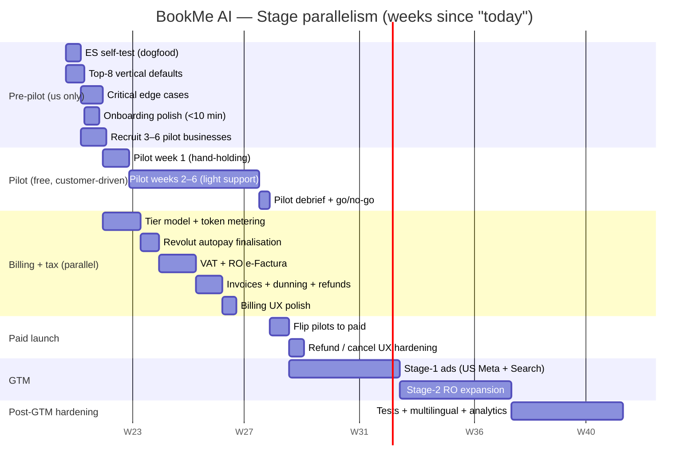
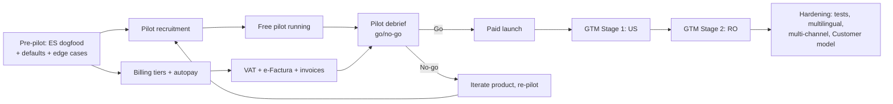
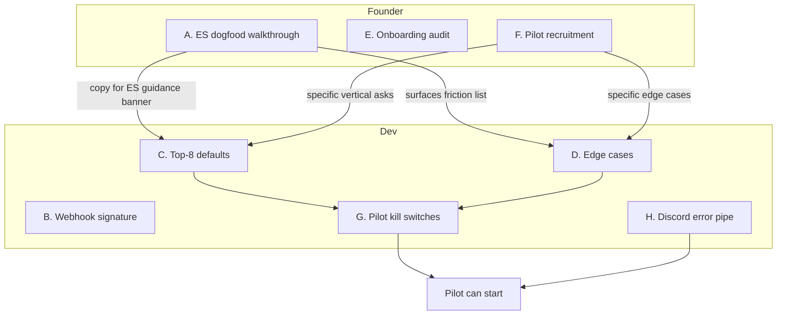
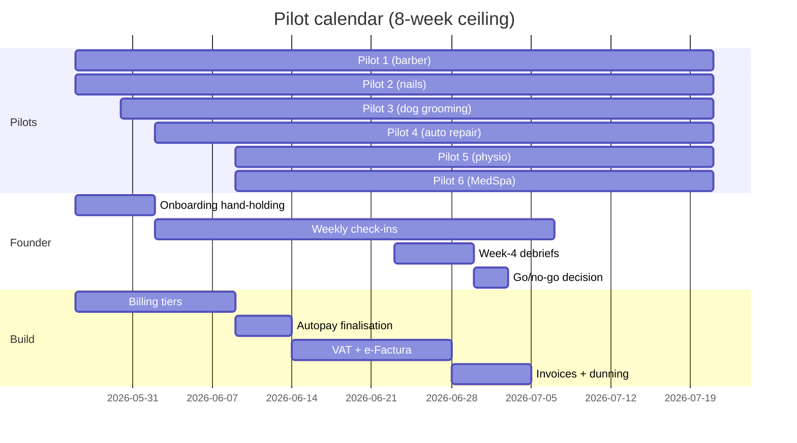
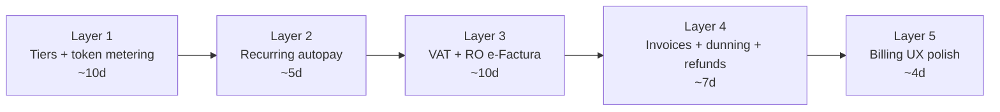
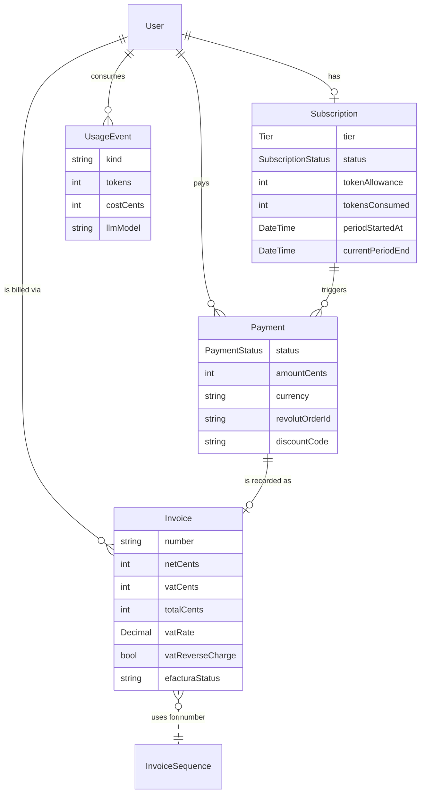
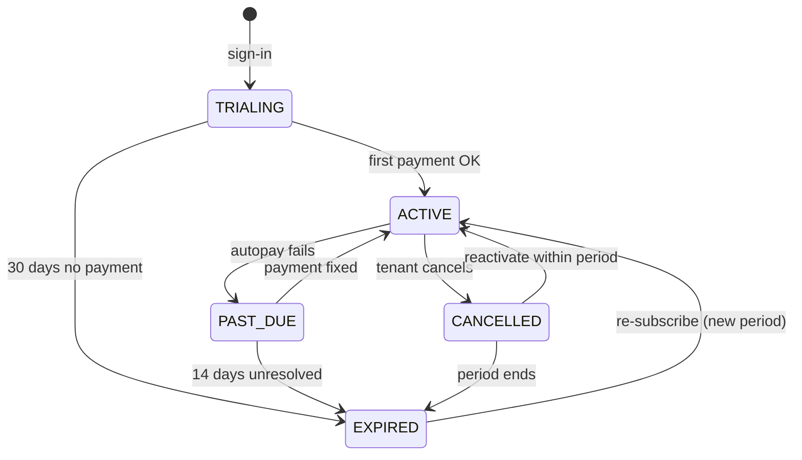
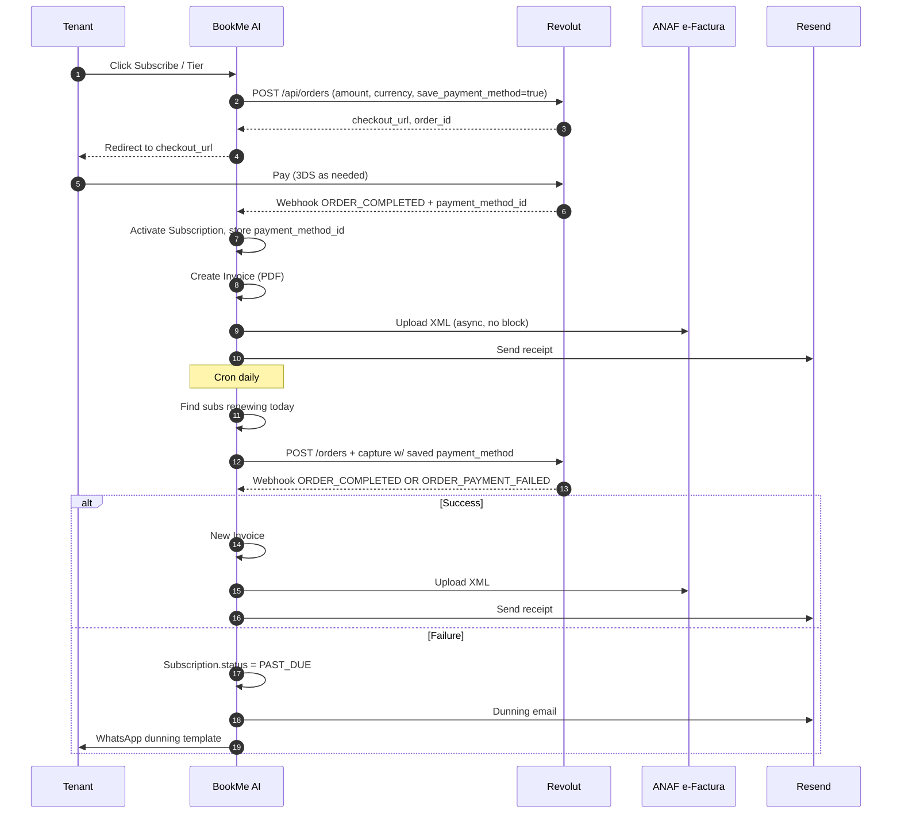
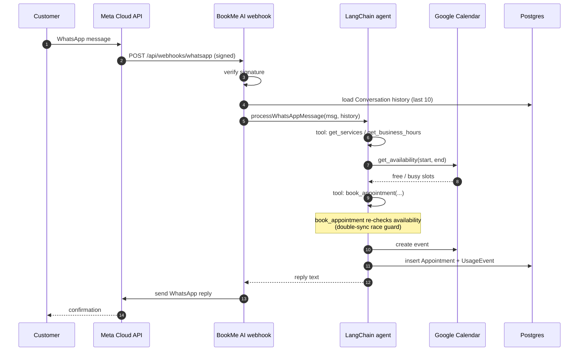
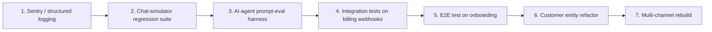

# Roadmap diagrams

All diagrams are mermaid blocks renderable directly on GitHub. They are inlined where they're most useful (Gantt in [`README.md`](../README.md), flowcharts and ERD in the relevant stage docs), and **collected here** for easy linking.

Index:

- [Critical path & parallelism (Gantt)](#critical-path--parallelism)
- [Stage dependency graph](#stage-dependency-graph)
- [Pre-pilot work parallelism](#pre-pilot-work-parallelism)
- [Pilot calendar](#pilot-calendar)
- [Billing layer sequence](#billing-layer-sequence)
- [Billing data model (ERD)](#billing-data-model-erd)
- [Subscription state machine](#subscription-state-machine)
- [Money flow sequence](#money-flow-sequence)
- [Customer booking sequence (WhatsApp → Calendar)](#customer-booking-sequence-whatsapp--calendar)
- [Post-GTM hardening order](#post-gtm-hardening-order)

---

## Critical path & parallelism

## Stage dependency graph

## Pre-pilot work parallelism

## Pilot calendar

## Billing layer sequence

## Billing data model (ERD)

## Subscription state machine

## Money flow sequence

## Customer booking sequence (WhatsApp → Calendar)

## Post-GTM hardening order

